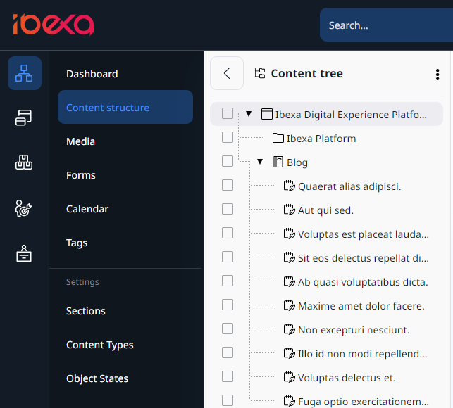

# Content tree

Content tree is the place where you can navigate through all the content items in your application.
If you want to browse your application's content items, in the main menu, go to the **Content** -> **Content structure**.
The **Content tree** area is an expandable content menu of your website.

The same tree structure is used in other areas of the Content menu, such as **Media** or **Forms**.

Unique icons for each content type instantly show you what type of content you are selecting. To add custom icons to your content tree, follow the [configuration tutorial in developer documentation]([[= developer_doc =]]/administration/back_office/back_office_elements/custom_icons/#customize-content-type-icons).

For more information about custom configuration, go to [Content tree]([[= developer_doc =]]/administration/back_office/content_tree/) in developer documentation.

Within the content tree, hidden content is greyed out in the tree view.

To simplify the content tree, big lists are collapsed and include a **Show more** icon.
Click it to expand the branches of the tree.
**Collapse all** option, which is available in the context menu, closes all expanded sections.

### Add folders

You can organize the tree by creating additional folders and subfolders of the **Content structure**.
A similar procedure applies to other areas of the system where the tree hierarchy is used.

1\. Go to **Content** -> **Content structure**.

2\. In the upper-right corner click **Create content**.

3\. From the available content types, select **Folder**, and click **Create**.

4\. Enter name for the new folder.

5\. (Optional) Add folder description.

6\. Click **Publish**.

The newly created folder is now visible in the content tree.

<!--ARCADE EMBED START-->
<iframe src=""https://demo.arcade.software/eKT6FDQsAJPsyQs59OlK?embed&embed_mobile=tab&embed_desktop=inline&show_copy_link=true"" title="Content tree - add folder" frameborder="0" loading="lazy" webkitallowfullscreen mozallowfullscreen allowfullscreen allow="clipboard-write" style="position: absolute; top: 0; left: 0; width: 100%; height: 100%; color-scheme: light;" ></iframe>
<!--ARCADE EMBED END-->