# User interface

## Dashboard

The first screen that you see after logging in is **Dashboard**.
It is default dashboard and contains following blocks:

- **Quick actions** - displays most popular/used actions and shortcuts, for example, **Create Content**.

- **Recent activity** - a list of last activities (maximum 10), including timestamp, user data, and activity type.
Available filters are: User(s), Activity type (create, update, publish, delete, hide, show) and Activity area (product, content).

- **Ibexa news** - a list of recent blog posts or articles published at `ibexa.co` blog.
It includes title, image, timestamp, and link to article details. List can containt minimum 1 and maximum 10 links.

- **Review queue** - a list of Content items which user or User group can review.

- **My content** - a list of Content items created by the user currently logged in.

- **Common content** - a list of Content items created by all the organization that the user belongs to. You can select any of these items and view them in detail or start [editing them](create_edit_content_items.md) from this point.
You can also [reschedule or cancel planned publications](../content_management/schedule_publishing.md#reschedule_or_cancel_publications) using the dashboard.

From any page you can always return to the **Dashboard** screen by clicking the logo in the upper left corner.

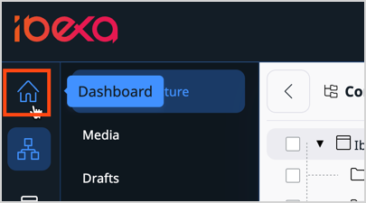

## Customizable dashboard

You can customize the dashboard depending on your needs.
Customized dashboard previews a set of widgets selected by the user.

It provides quick overview of these areas, that are commonly used, excluding those that are not used, or used rarely.
This solution improves productivity, allows to enhance the default dashboard with additional widgets, and helps to make better business decisions based on data.

By highlighting important information, users can work more efficiently with a clear view of tasks and deadlines.
Customization includes also choosing one of predefined layouts and adding custom ones to use them in dashboards.

### Customize dashboard

To customize dashboard, on the main page, click **Customize dashboard**.

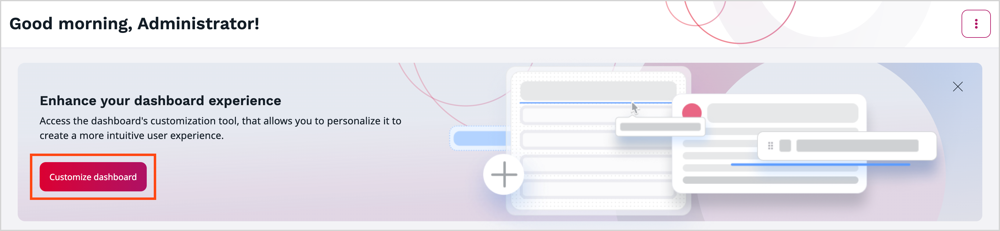

This action opens an online editor - Dashboard Builder.

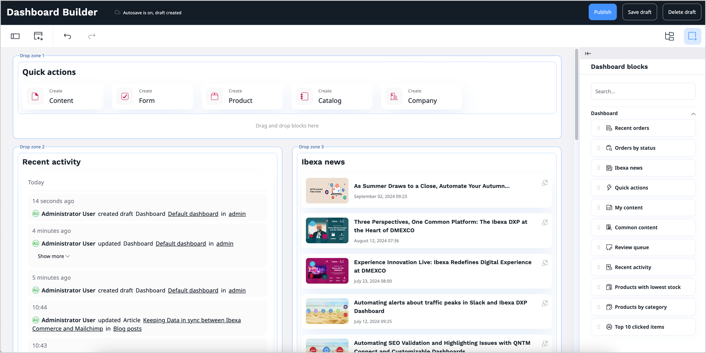

#### Dashboard Builder interface

Dashboard Builder user interface consists of:

A. Drop zone

B. Elements / Structure view toolbar

C. Buttons:

|Name|Icon|Use|
--------|-----------|----------
|Fields|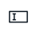|Edit dashboard name.|
|Switch layout|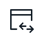|Switch layout for the dashboard.|
|Undo||Undo latest change.|
|Redo||Redo latest change.|
|Structure view|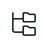|Access Structure view toolbar.|
|Elements menu|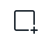|Access Elements toolbar.|
|View switch|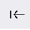|Move Elements / Structure toolbar to the other side of the screen.|

Dashboard Builder has two main toolbars that you can use while creating a dashboard:

- **Elements** - consists of all available blocks that you can use by dragging them and dropping on a drop zone.

- **Structure view** - shows a structure of your dashboard, including its division into zones and the blocks that they contain.

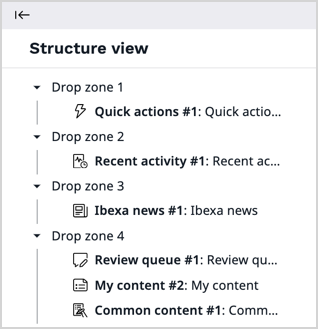

### Choose layout

For new dashboard you can choose layout which defines the available zones.
Applying a layout divides the dashboard into the defined zones. The zones are placeholders for blocks.

To do it, click the **Switch layout** icon on the left side of the upper toolbar, then choose one from available layouts, and click **Submit**.

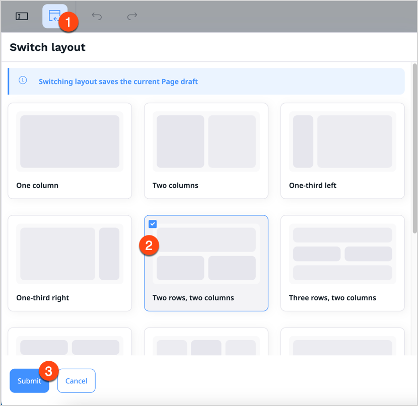

#### Add blocks

In Dashboard Builder you can access a menu of **Elements** — it includes a set of blocks of content that you can add to the zones of the dashboard.

You can choose from available blocks:

- Recent orders
- Orders by status
- Ibexa news
- Quick actions
- My content
- Common content
- Review queue
- Recent activity
- Products with lowest stock
- Products by category
- Top 10 clicked items

!!! Tip

    For detailed description of available blocks, see [Dashboard block reference](dashboard_block_reference.md).

Add a block by dragging it from the menu to an empty place on a zone.
Do not worry about placing blocks in the proper place from the start.
You can reorder them at any time by dragging and dropping them in the desired location.
You can reorder blocks in a few ways:

- drag and drop block in the desired location on a drop zone
- use **Move up block** or **Move down block** option from the block toolbar
- access Structure view and use 'Move up' and 'Move down' function in the settings of the block

When you add a new block to the drop zone, drop it in the blue highlighted area. Before you drop it, a bold line appears  - it helps you see the position of the newly added block in relation to other, already added blocks.

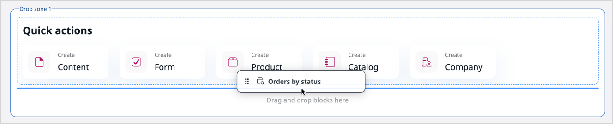

When you add a block by dragging it from Elements menu into the drop zone,
the block settings panel open immediately where you can configure all block properties.

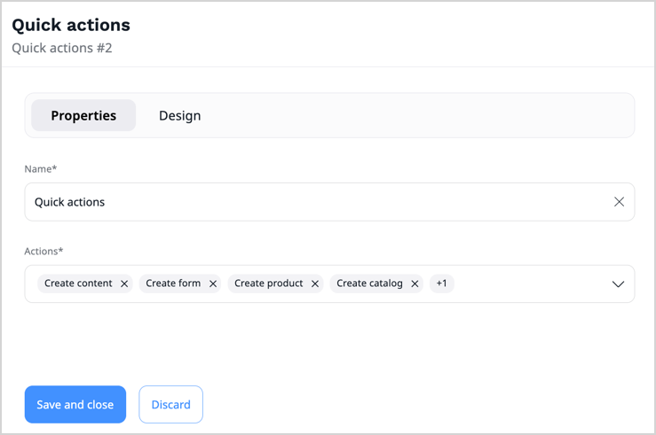

This is a default behavior. You can globally turn off automatic opening of the block settings panel in the user settings.
First, access your user settings on the right side of the top bar:

Then, go to **Preferences** tab, **Edit** section.
Here, you can find `Automatically open block settings in builder` setting, which, by default, is set up to `enabled` value.
To change this behavior, click on **Edit** icon, find the setting, and change its value to `disabled`.

#### Work with blocks

Each block has its special properties.
You can access them by placing the cursor on the added block and clicking the **Block settings** icon.

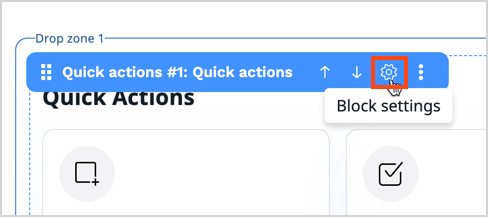

Settings available for blocks are divided into two tabs: **Properties** and **Design**.
The settings available on the **Properties** tab are tailored to the block's content.
For a description of these settings, see [Dashboard block reference](dashboard_block_reference.md).

To save changes, click **Save and close**.

#### Edit dashboard

At any time you can edit an active customized dashboard.
To do it, click an icon in the top right corner, and then click **Edit My dashboard**.

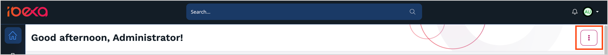

This action opens Dashboard Builder that allows you to edit an active customized dashboard and publish its updated version.
You can see all the implemented changes after reloading starting screen.

#### Select active dashboard

When you create new customized dashboard, you can choose, which dashboard you want to set as an active.

To do it, access your user settings on the right side of the top bar.
Then, go to **Preferences** tab, **Dashboard** section, and click **Edit**.

Select the dashboard, that you want to set as active, and click **Save**.

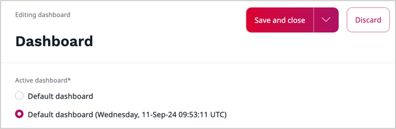

#### Permissions

In order to be able to customize dashboard, you need to have `dashboard/cutomize` policy.
By default, all the users belonging to the `Editors` User Group, have `Dashboard` role assigned, so they can edit, create, or delete dashboard.
If, by any reason, you want to narrow this permission, you can set up specific limitations.

For more information about setting up a permission system, see [Work with permissions](work_with_permissions.md).

!!! Tip

    For a list of available policies, permissions, and limitations, see [Permissions]([[= developer_doc =]]/permissions/permissions/), [Limitations]([[= developer_doc =]]/permissions/limitations/), and [Policies]([[= developer_doc =]]/permissions/policies/).

## Menu

The left side menu allows you to move between important sections of the application.

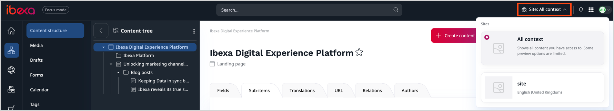

Depending on the product edition and your [permissions](../permission_management/permission_system.md), the top level sections on the leftmost pane may include, for example:

- **Content**, which gives you access to the content Repository.
It lets you navigate the Content Tree, create, edit, move, copy, delete content, etc.
- [[% include 'snippets/experience_badge.md' %]] [[% include 'snippets/commerce_badge.md' %]] **Site**, which enables you to create and edit block-based Pages and manage multiple websites.
- **PIM**, which enables you to handle products presented on the website, including their specifications and pricing.
- **Admin**, which is the administration panel where you can manage Users, Sections, permissions, etc.

## Content Tree

If you want to navigate through your website with a menu, go to the **Content** tab, and select **Content structure**.
**Content Tree** in the left sidebar opens an expandable content menu of your website.

Unique icons for each Content Type instantly show you what type of content you are selecting. To add custom icons to your Content Tree, follow [configuration tutorial in developer documentation.]([[= developer_doc =]]/administration/back_office/back_office_elements/custom_icons/#customize-content-type-icons)

Hidden content is greyed out in the tree view.

To simplify the Content Tree, big lists are collapsed and include a **Show more** icon. 
You can select it to expand the branches of the tree.
Available from the context menu, the **Collapse all** option that closes all expanded sections.

For more information on custom configuration, go to [Content Tree]([[= developer_doc =]]/administration/back_office/content_tree/) in developer documentation.

## Content browser

During your work with [[= product_name =]] you might need to select content from the Repository.
This happens, for example, when you want to move or copy a Content item, embed an image, link two Content items, etc.
In such cases, you use the **Content Browser**.

To access the **Content Browser**, go to the **Content** tab and select **Content structure** or **Media**.
Then, select a file you want to copy or move and click the corresponding button in the top right corner.
The Content Browser window opens, and you can select the new location of the selected file or its copy.

With the **Content Browser**, you can switch between the Grid, Panels and Tree views to navigate through the content of the website.
Depending on your permissions, you might be able to see the regular content, media, forms, site skeletons and User accounts.
You can also use the **Content Browser** to search the Repository for content, edit content, create bookmarks, and create new content when needed.

!!! note

    If you have administrator permissions, you can also view and manage User accounts and site skeletons in the **Admin** tab.
    
    For more information about users and permissions, see [Users](../permission_management/permissions_and_users.md).
    
    For more information about site skeletons, see [Site skeletons]([[= developer_doc =]]/multisite/site_factory/site_factory_configuration/#site-skeletons).