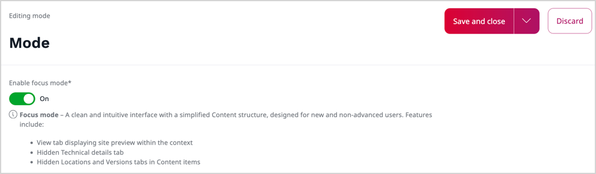

# User interface

## Top bar

At the top of the main screen you can see a top bar.
Depending on your location within the Back Office, it can contain the following important features:

- Logo in the left corner, which is a direct link to the [dashboard](#dashboard)
- "Focus mode" badge which informs you that the [focus mode](#focus-mode) is on
- Global search field that allows you to [find content](../search/search_for_content.md) by checking all searchable Fields
- Drop-down that changes the site context
- Notification icon that informs you about incoming assignments, for example, items assigned for [your review](../content_management/workflow_management/editorial_workflow.md#review-queue)
- User avatar with a drop-down menu with access to [user profile and settings](get_started.md#view-and-edit-user-profile)

!!! note "Site context"

    Changing the site context results in the [Content Tree](#content-tree) showing content items that belong to the selected website.
    The appearance of Content items can also change if they use different designs or languages depending on the [SiteAccess](../website_organization/multisite.md#siteaccess) settings.

## Dashboard

The first screen that you see after logging in is [Dashboard](dashboard.md).
It is the default dashboard and contains selected blocks.

You can customize the dashboard by changing the blocks and the layout.
For more information, see [Work with dashboard](work_with_dashboard.md).

## Main menu 

The main menu allows you to move between important sections of the application.

Depending on the product edition and your [permissions](../permission_management/permission_system.md), the main menu may include, for example:

- **Content**, which gives you access to the content Repository.
It lets you navigate the Content Tree, create, edit, move, copy, delete content, etc.
- [[% include 'snippets/experience_badge.md' %]] [[% include 'snippets/commerce_badge.md' %]] **Site management**, which enables you to create and edit block-based Pages and manage multiple websites.
- **PIM**, which enables you to handle products presented on the website, including their specifications and pricing.
- **Admin**, which is the administration panel where you can manage Users, Sections, permissions, etc.

## Content Tree

If you want to navigate through your website with a menu, in the main menu, go to the **Content** -> **Content structure**.
The **Content Tree** area is an expandable content menu of your website.

Unique icons for each Content Type instantly show you what type of content you are selecting. To add custom icons to your Content Tree, follow [configuration tutorial in developer documentation.]([[= developer_doc =]]/administration/back_office/back_office_elements/custom_icons/#customize-content-type-icons)

Hidden content is greyed out in the tree view.

To simplify the Content Tree, big lists are collapsed and include a **Show more** icon. 
You can select it to expand the branches of the tree.
Available from the context menu, the **Collapse all** option that closes all expanded sections.

For more information on custom configuration, go to [Content Tree]([[= developer_doc =]]/administration/back_office/content_tree/) in developer documentation.

## Content browser

During your work with [[= product_name =]] you might need to select content from the Repository.
This happens, for example, when you want to move or copy a Content item, embed an image, link two Content items, etc.
In such cases, you use the **Content Browser**.

To access the **Content Browser**, go to the **Content** tab and select **Content structure** or **Media**.
Then, select a file you want to copy or move and click the corresponding button in the top right corner.
The Content Browser window opens, and you can select the new location of the selected file or its copy.

With the **Content Browser**, you can switch between the Grid, Panels and Tree views to navigate through the content of the website.
Depending on your permissions, you might be able to see the regular content, media, forms, site skeletons and User accounts.
You can also use the **Content Browser** to search the Repository for content, edit content, create bookmarks, and create new content when needed.

!!! note

    If you have administrator permissions, you can also view and manage User accounts and site skeletons in the **Admin** tab.

    For more information about users and permissions, see [Users](../permission_management/permissions_and_users.md).
    
    For more information about site skeletons, see [Site skeletons]([[= developer_doc =]]/multisite/site_factory/site_factory_configuration/#site-skeletons).

## Focus mode

Focus mode helps editors focus on information that is only relevant to their line of work and omit technical details that would distract.
It is enabled by default, after you log in.
If you need access to certain settings or technical details, you can [disable the focus mode](#disable-focus-mode) at any time.

Dark theme for Content Tree
: In areas where the Content Tree is displayed, for example, in **Content structure**, the tree is displayed on a dark background.

Settings unavailable in Content area
: In Focus mode, in **Content** area of the main menu, the **Settings** part of the menu is not available.

Content item view
: If you select a specific [SiteAccess](translate_content.md#siteaccess) from the **Site context** drop-down list on the right side of the top bar and then browse Content items in Content Tree, they are displayed in full view, with a limited set of actions available.
To display the Content item details view with more actions, click **Exit full view**.

!!! tip

    Even when you're out of the full view or not in Focus mode, you can still preview the Content item in the **View** tab.

Different details view tabs in Focus mode and when it is disabled
: In Focus mode, the tabs in Content item's detail view are different than the ones visible when it is disabled.
Additionally, they are displayed in different order to expose the ones that are more important from the editor's perspective.

Different columns available for selection
: You can decide which columns are displayed in the **Sub-items** table, to adjust the view to your use case.
The list of columns available for selection is limited in Focus mode.

### Disable Focus mode

Focus mode is enabled by default when you first log into [[= product_name =]], but you can toggle it in two places:

- in User settings

- in the drop-down menu on the right side of the top bar

