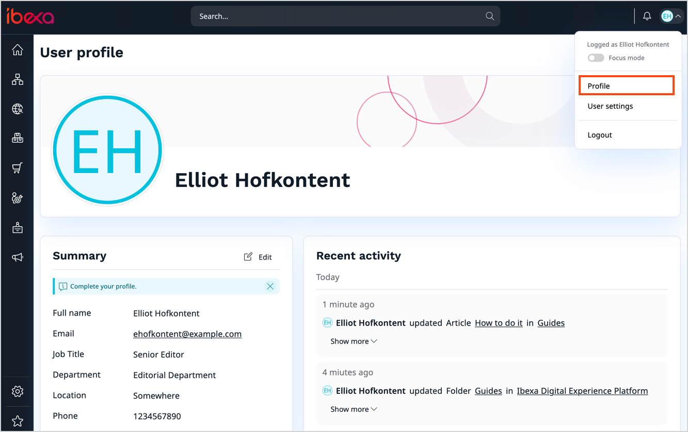
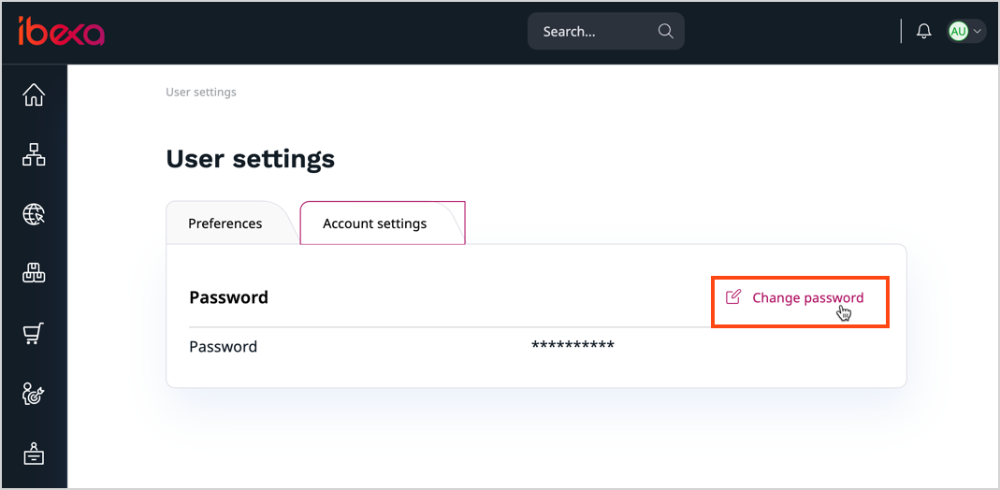
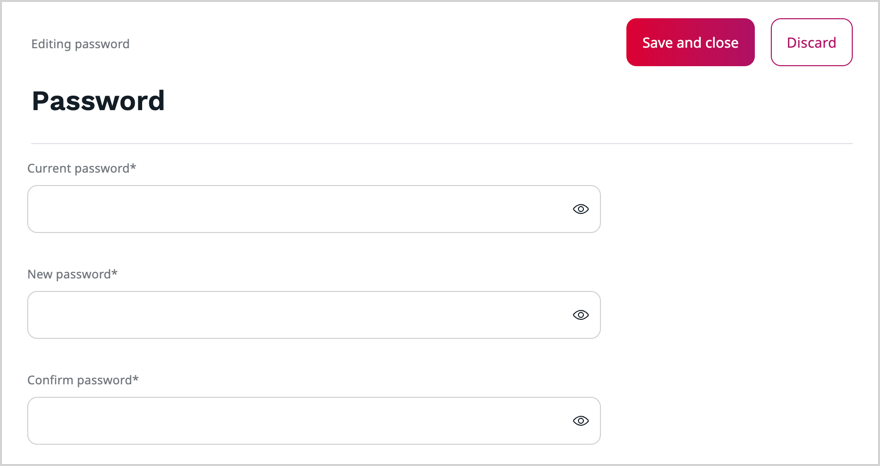

# Get started

[[= product_name =]] consists of the technical platform for creating and managing
online experiences, designed for developers and end-users alike.
It includes a web framework, APIs and a content repository.
It features a customizable user interface where you can work with the content, products, media, manage other functionalities, and administer the platform.

Depending on the product edition, [[= product_name =]] can provide advanced capabilities in such areas as:

- [content management](content_management.md)
- [product management](pim.md)
- [customer management](customer_management.md)

!!! note "Installation"

    Only administrators can [install]([[= developer_doc =]]/getting_started/install_ibexa_dxp/) [[= product_name =]].
    They should provide you with the address of the installation.

## Access the back office

To access the back office (or the user/editor interface), add `/admin` to the address provided by the administrator.
For example, if your website's URL is `www.my-site.com`, you enter the editing interface through `www.my-site.com/admin`.

If you're the administrator, the default administrator account information is:

- username: `admin`
- password:` publish`

Otherwise, to login, you must get your user credentials from the administrator, and enter them on the login screen.

### View and edit user profile

If you're an editor, depending on the system configuration, you may be able to view and edit the user profile, which can contain the following information:

- Avatar image
- First and last name
- Email
- Department
- Position
- Location
- Signature
- Roles the user is assigned to
- Recent activity

!!! note

    To display the [recent activity](recent_activity.md) log, your [user role](../permission_management/permissions_and_users.md) must have the **Activity Log / Read** permission.

To access your user profile, in the upper-right corner of the screen, click your avatar icon.
Then, from the drop-down menu, select **Profile**.

To edit your user profile, in the **User profile** screen, in the **Summary** section, click **Edit**.

You can now modify the following entries:

- Avatar image
- First and last name
- Signature
- Department

!!! note

    The fields may differ depending on your system configuration.

To edit your avatar, in the **Image** area, click **Upload file** or drag and drop your photo.
If necessary, you can [edit the photo with the Image Editor](edit_images.md).
After you finish, the avatar is uploaded and is visible in the back office.

!!! note

    If you don't set your own image, a default avatar with your initials is displayed.

To save changes to the user profile, click **Update**.

### User settings

You can access your user settings on the right side of the top bar:

Here you can [change your user password](get_started.md#change-the-password) and define your user preferences, such as preferred timezone, short and full date, and time format, or back office language.

**Location**

|Setting|Description|
--------|-----------|
|Default currency|Sets the default currency used in the back office.|
|Toggle In-Context translation feature|Enables or disables integration with Crowdin to navigate the interface while translating.|
|User Time Zone|Sets time zone in the back office.|
|Short date and time format|Sets short date and time format used in the back office.|
|Full date and time format|Sets full date and time format used in the back office.|
|Language|Sets the default language used in the back office.|

**Content authoring**

|Setting|Description|
--------|-----------|
|[Autosave draft every given period](../content_management/content_versions.md/#autosave)|Enables or disables autosaving drafts.|
|Seconds till next draft autosave|Sets time period for next autosave.|
|Enable character count in online editor|Enables or disables charactes count.|
|Automatically open block settings in builders|Enables or disables the behavior of blocks used in builders.|

**Browsing**

|Setting|Description|
--------|-----------|
|Number of items displayed in the table|Sets the number of items displayed in sub-items.|
|Location preview|Enables or disabled a thumbnail preview on the content tree.|

**Mode**

|Setting|Description|
--------|-----------|
|Focus mode|Enables or disables the [focus mode](discover_ui.md#focus-mode).|

**Dashboard**

|Setting|Description|
--------|-----------|
|Active dashboard|Sets which dashboard is displayed after you log in.|

### Change the password

You can change your user [password]([[= developer_doc =]]/users/passwords/) at any time.
To do it, first, access your user profile, and go to **Account settings** tab.
Then, click **Change password**.

Fill in all the required fields and click **Save and close** to save changes.
Click **Discard** to reject your changes and return to the previous screen.

<!--ARCADE EMBED START-->
<iframe src="https://demo.arcade.software/hmXfcsazcGSJbHzOpKAx?embed&embed_mobile=tab&embed_desktop=inline&show_copy_link=true" title="Log in, navigate to the user profile, and change the password" frameborder="0" loading="lazy" webkitallowfullscreen mozallowfullscreen allowfullscreen allow="clipboard-write" style="position: absolute; top: 0; left: 0; width: 100%; height: 100%; color-scheme: light;" ></iframe>
<!--ARCADE EMBED END-->
