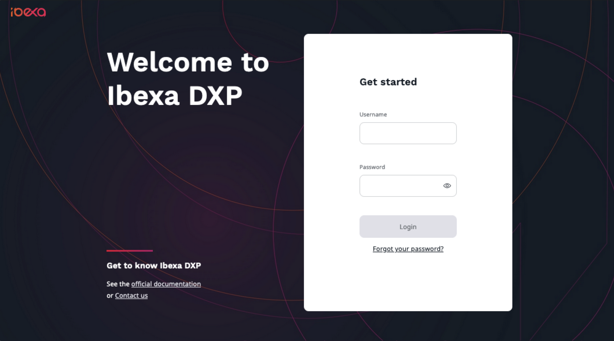
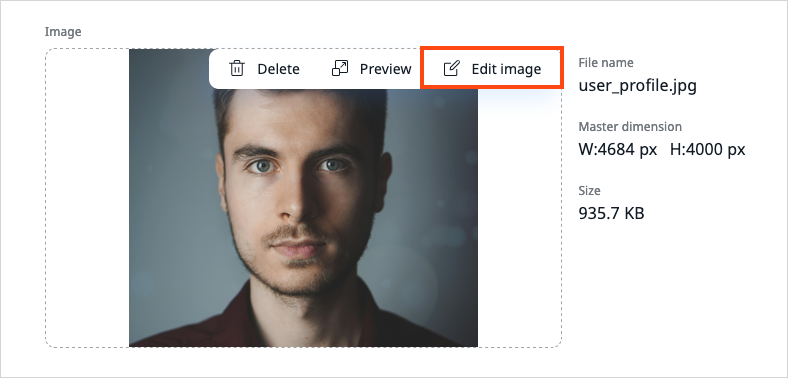
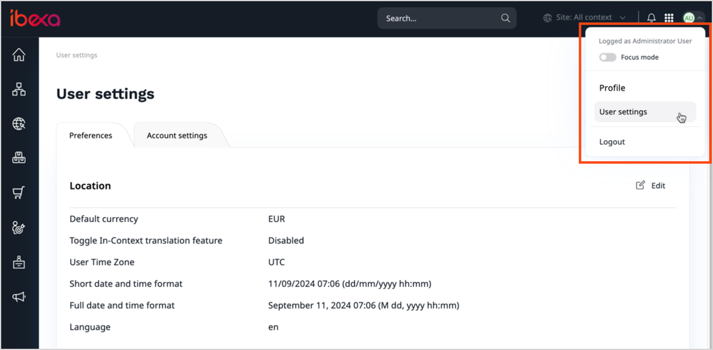

# Get started

[[= product_name =]] consists of the technical platform for creating and managing 
online experiences, designed for developers and end-users alike.
It includes a Web framework, APIs and a Content Repository.
It features a customizable user interface where you can work with the content, 
products, media, as well as manage other functionalities and administer the platform.

Depending on the product edition, [[= product_name =]] can provide advanced capabilities in such areas as:

- content editing: [editing and creating pages](../content_management/create_edit_pages.md), [editorial workflow](../content_management/workflow_management/editorial_workflow.md), etc.
- product management: [managing catalogs](../pim/work_with_catalogs.md), [managing product categories](../pim/work_with_product_categories.md)
- customer data management: [managing customers](../customer_management/manage_customers.md), etc.

!!! note "Installation"

    [[= product_name =]] must be [installed by the administrators]([[= developer_doc =]]/getting_started/install_ibexa_dxp/).
    They should provide you with the address of the installation.

## Access the Back Office

To access the Back Office (or the user/editor interface), add `/admin` to the address provided by the administrator.
For example, if your website's URL is `www.my-site.com`, you enter the editing interface through `www.my-site.com/admin`.

If you are the administrator, the default administrator account information is:

- username: `admin`
- password:` publish`

Otherwise, to login, you must get your user credentials from the administrator and enter them on the login screen.

### Edit user profile

You can edit your profile and modify the following data:

- Avatar image
- First and last name
- Signature
- Department

!!! note
    The fields may differ depending on your system configuration.

1\. To modify profile, in the upper-right corner, click the avatar icon. 

2\.From the drop-down menu, select **Profile**.

3\. In the User profile screen, in the **Summary section**, click **Edit**.

4\. Go to **Image** and click Upload file or drag and drop your photo.
If necessary, you can edit the foto using Image Editor.

5\. Now your avatar photo has been uploaded and is visible in the Back Office.

6\. To save changes, click **Update**.

If you don't set the your own image, a default avatar with your initials is then displayed.

### Change the password and other user settngs

You can access your user settings on the right side of the top bar:

Here you can change your user password and define your user preferences,
such as preferred timezone, date and time format, or Back Office language.

**Location**

|Setting|Description|
--------|-----------|
|Default currency|Sets the default currency used in the Back Office.|
|Toggle In-Context translation feature|Enables or disables integration with Crowdin to navigate the interface while translating.|
|User Time Zone|Sets time zone in the Back Office.|
|Date and time format|Sets format used in the Back Office.|
|Language|Sets the default language used in the Back Office.|

**Content authoring**

|Setting|Description|
--------|-----------|
|[Autosave draft every given period](../content_management/content_versions.md/#autosave)|Enables or disables autosaving drafts.|
|Seconds till next draft autosave|Sets time period for next autosave.|
|Enable character count in Online Editor|Enables or disables charactes count.|
|Automatically open block settings in builders|Enables or disables the beahvior of blocks used in builders.|

**Browsing**

|Setting|Description|
--------|-----------|
|Number of items displayed in the table|Sets the number of items displayed in sub-items.|
|Location preview|Enables or disabled a thumbnail preview on the Content Tree.|

**Mode**

|Setting|Description|
--------|-----------|
|Focus mode|Enables or disables focus mode.|

**Dashboard**

|Setting|Description|
--------|-----------|
|Active dashboard|Sets which dashboard is displayed after you log in.|

