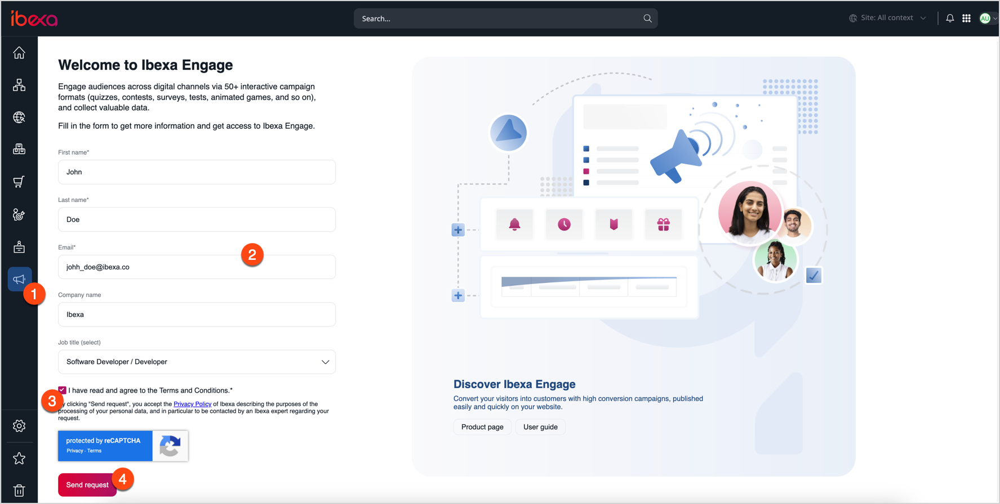
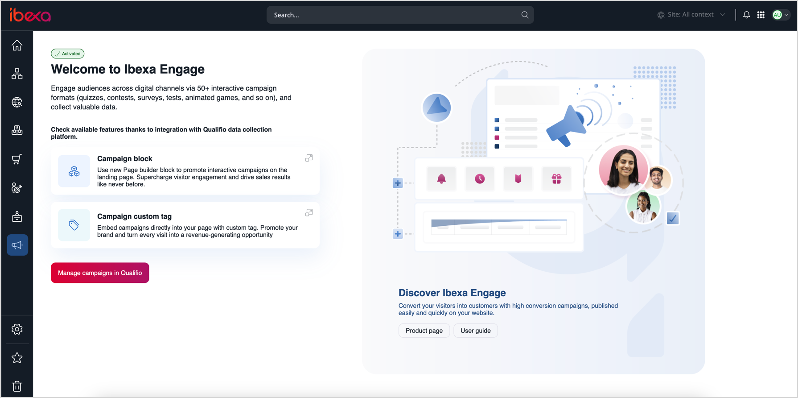

# [[= product_name_engage =]]

[[= product_name_engage =]] is a data collection tool.
It gives you the ability to use the [Qualifio](https://qualifio.com/) tools to engage your audiences.
You can use interactive content to build relationships and collect important data, for example, a list of recent orders, or personal information about customers.

## Request access

To use [[= product_name_engage =]], you must make arrangements with [[= product_name_base =]] to define the initial configuration, and then get and set up a user account.

1\. On the left menu panel, go to **Ibexa Engage**.

2\. On the left panel, go to **Ibexa Engage**.

3\. On the welcome page, provide the required information:

- First and last name
- Email address

4\. Accept **Terms and Conditions**, and then click **Send request**.

[[= product_name_base =]] team creates the user account and provides you with its details.
An invitation link is sent during the setup process.
Once the registration and configuration process is completed, the welcome page displays information about campaign tools available with [[= product_name_engage =]] and a link to [Qualifio documentation](https://support.qualifio.com/hc/en-us/categories/202280638-Campaigns) where you can get information about creating and managing campaigns.

Click the **Manage campaigns in Qualifio** button to open a Qualifio page, where you can create and manage campaigns.

## Campaign

A campaign is a set of different concepts, grouped into steps, and open to configuration.
You can use a campaign to interact with viewers, boost ad impressions, or gather cookies from targeted audiences.

Campaign can contain elements like a welcome screen, a form step, an interaction element, or an exit screen.

You can use Qualifio's existing templates and interactive elements, such as quizzes, pools, and forms, to create visually appealing, customized campaigns.
You can also configure the backgrounds, themes, or designs, and set up a specific time frame for each campaign.

Each campaign comes with a unique ID - string of numbers, that the platform automatically defines during the creation of campaign. Campaign ID is a reference to the campaign in the applications, services and data connections.

There are two types of campaigns:

- **Anonymous** - engages with the audience, increases the advertising impressions, or collects cookies of personalized audiences.
- **Identified** - gathers information about the user who fills out an identification form.

## Publication channel

Every campaign includes at least one publication channel, which you can choose from the three options the platform offers:

- **Widget/iframe** - uses a JavaScript code or an HTML iframe from Qualifio. Additionally, you can use oEmbed, Facebook Instant articles, and AMP technologies to publish iframes. You need to manually paste the code into your website or CMS.

- **Minisite** - uses a unique URL from Qualifio that hosts the campaign. This URL points to your subdomain.

- **Mobile** - uses a link from Qualifio to integrate a campaign that is optimized for mobile usage.

!!! note
    By default, every type of publication channel is responsive and compatible with all mobile devices.

## Work with campaigns

You can create, configure, and manage campaigns with [Qualifio Engage](https://developers.qualifio.com/docs/engage/).
To access the Qualifio Manager page and create or manage campaigns, click the **Manage campaigns in Qualifio** button under the **Ibexa Engage** menu.
To display your campaign on the website, use one of the available tools - Campaign block or Campaign custom tag.

For more information about creating and managing campaigns, see [Qualifio Engage documentation](https://support.qualifio.com/hc/en-us/categories/202280638-Qualifio-Engage).

### Campaign block

To promote your campaign, you can add a [Campaign block](../content_management/block_reference.md#campaign-block) to a page in Page Builder.
In the block's settings, you can select a campaign that you want to display from a drop-down list.
This list includes all campaigns available on user's Qualifio account which are active or scheduled to launch in the future.

You can set the dimensions of the field in which the campaign is displayed. To do it, insert width and height values in the proper fields.
If size fields are blank, the system sets default template values. It's recommended to adjust them for better results.

### Campaign custom tag

You can embed a campaign within the [Rich Text field](../content_management/create_edit_content_items.md#edit-rich-text-fields) by using a Campaign custom tag.
To do it, insert **Campaign** content item in the Rich Text Field and choose campaign from the drop-down list.
This list includes all campaigns available on user's Qualifio account which are active or scheduled to launch in the future.

You can set the dimensions of the field in which the campaign is displayed. To do it, select units, and provide width and height values in the proper fields.
If size fields are blank, the system sets default template values. It's recommended to adjust them for better results.

