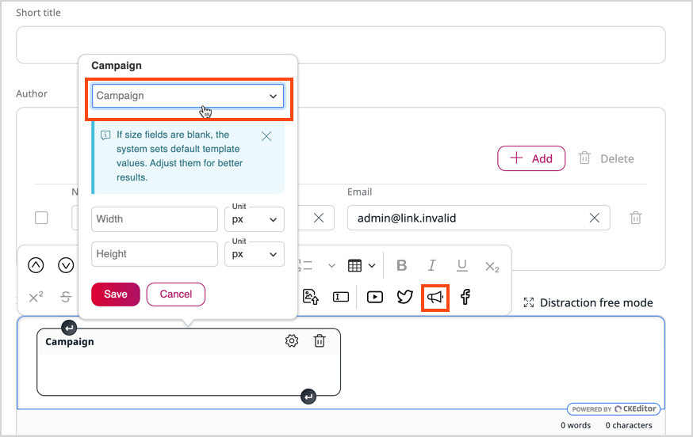

# Ibexa Engage

[[= product_name_engage =]] is a data collection tool. It gives you the ability to use the [Qualifio](https://qualifio.com/) tools to engage your audiences.
You can use interactive content to build relationships and collect important data, for example, a list of recent orders, or personal information about customers.

## Request access

To use [[= product_name_engage =]], you must make arrangements with [[= product_name =]] to define the initial configuration, and then get and set up user account.

1\. Go to the Back Office.

2\. On the left panel, go to **Ibexa Engage**.

3\. On the welcome page, provide the required information:

- First and last name
- Email address

4\. Select the **I have read and agree to the Terms and Conditions** checkbox, and then click **Send request**.

[[= product_name =]] creates and provides user account. An invitation link is sent during the setup process.
Once the registration and configuration process is completed, the welcome page displays information about campaign tools available with [[= product_name_engage =]] and link to [Qualifio documentation](https://support.qualifio.com/hc/en-us/categories/202280638-Campaigns) where you can get information about creating and managing campaigns.

Click **Manage campaigns in Qualifio** button to open Qualifio page, where you can create and manage campaigns.

## Campaign

A campaign is a set of different concepts, grouped per steps, and open to configuration.

It can contain a welcome screen, a form step, an interaction element, an exit screen, and so on.

You can use Qualifio's existing templates and interactive elements, such as quizzes, pools, and forms, to create visually appealing, customized campaigns.
Users can configure the backgrounds, themes, and designs.

Use campaign to interact with viewers, boost ad impressions, or gather cookies from targeted audiences.

Each campaign comes with a unique ID - string of numbers, that the platform automatically defines at the creation. Campaign ID is a reference to the campaign in the applications, services and data connections.
You can set up a specific time frame for each campaign, use conditions, and design.

You can also set up prizes for customer when an email or another required pool is filled.
A prize can be, like special discount, bonus, or free access to some content.

## Publication channel

Every campaign includes a minimum of one publication channel that you can choose from the three options the platform provides for publishing a campaign:

- **Widget/iframe** - uses a JavaScript code or an HTML iframe from Qualifio. Additionally, you can use oEmbed, Facebook Instant articles, and AMP technologies to publish iframes. You need to manually paste the code into your website or CMS.

- **Minisite** - uses a unique URL from Qualifio that can hosts the campaign. This URL points to your subdomain.

- **Mobile** - uses a link from Qualifio to integrate a campaign that is optimized for mobile usage.

!!! note
    Each publication channel type is automatically responsive and can be used on any mobile device.

## Work with campaigns

You can create, configure, and create campaigns using [Qualifio Engage](https://developers.qualifio.com/docs/engage/).
To access the Qualifio Back Office page and create or manage campaigns, click the **Manage campaigns in Qualifio** button under the **Ibexa Engage** menu.
To display your campaign on the website, use one of the available tools - Campaign block or Campaign custom tag.
For more information about creating and managing campaigns, see [Qualifio Engage documentation](https://support.qualifio.com/hc/en-us/categories/202280638-Qualifio-Engage).

### Campaign block

To promote your campaign, you can add [Campaign block](../content_management/block_reference.md#campaign-block) in Page Builder.
In the **Campaign** tab you can choose campaign from the drop-down list. This list includes all campaigns available on user's Qualifio account which are active or scheduled to launch in the future.

### Campaign custom tag

You can embed campaign in the Rich text field with Campaign custom tag.
To do it, select custom tag from the toolbar, and a choose campaign.

