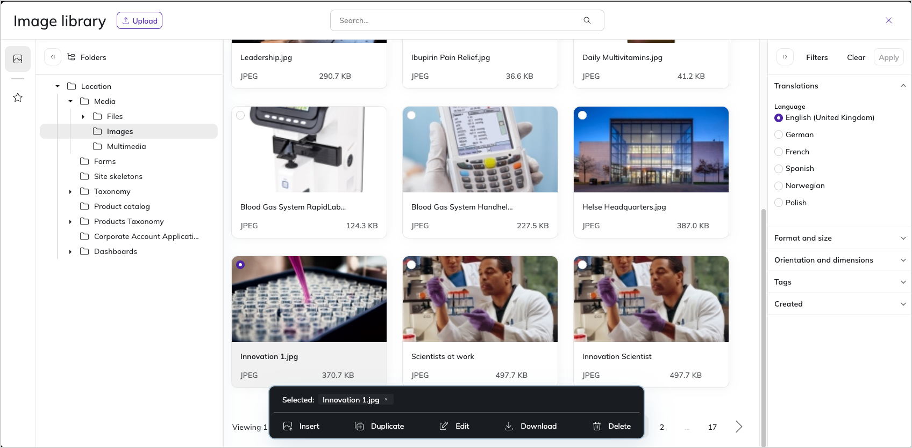

# Browse images

The image library is a dedicated browser for the image assets that you store in the Media section of the content tree.
It opens whenever you select an existing image in the back office, for example, when you add an image asset to a content item, or when you [insert an image into a Rich Text field](create_edit_content_items.md#edit-rich-text-fields).
In the image library you can search, filter, and preview image assets before you insert them into content.

## View modes

The main window of the image library is available in two display versions: grid view and list view.
To change the view mode, in the upper-right corner, click **View** and select the view that you need.

- Grid view contains an image preview, file format, and image size.
- List view contains a thumbnail, title, format, size, dimensions, creation date, and update date.

## Sort images

You can sort image assets in alphabetical order or by the creation date.
To sort image assets, in the upper-right corner, click **Date** and select the sorting method that you need.

## Search for images by keyword

The search option allows you to find image assets with a word or phrase.
To use it, in the upper part of the screen, click the **Search** field and enter a search keyword.
The application searches the assets for matches based on the keyword, including the file title.

## Filter images by attributes

With filtering by attributes, you can narrow the search results to the following attributes:

- language
- format
- file size
- orientation
- dimensions
- tags (this filter is available only when image assets have tags assigned to them)
- date of creation

To use it, in the right-side panel, select the attributes and click **Apply**.
You can combine both search methods: keyword search and attribute filters.

## Browse image folders

Image assets are organized and stored in folders, so the folder structure serves as another option for filtering assets.
To navigate through the folders, go to the left-side panel **Folders**, and in the folder tree view, click the folder that you want to open.

!!! note

    Filtering by attributes and browsing folders are complementary: the attribute filters narrow the results within the folder that you currently have open.

## Insert images into content

To insert an image asset, find the image with the search options, or manually locate the asset in the folder structure.
Next, click the image thumbnail.
The selected item is marked with a red dot in the upper-left corner.
To confirm the selection, in the bottom toolbar, click **Insert**.

You can select only one image at a time.
To deselect the image, click the thumbnail again.
