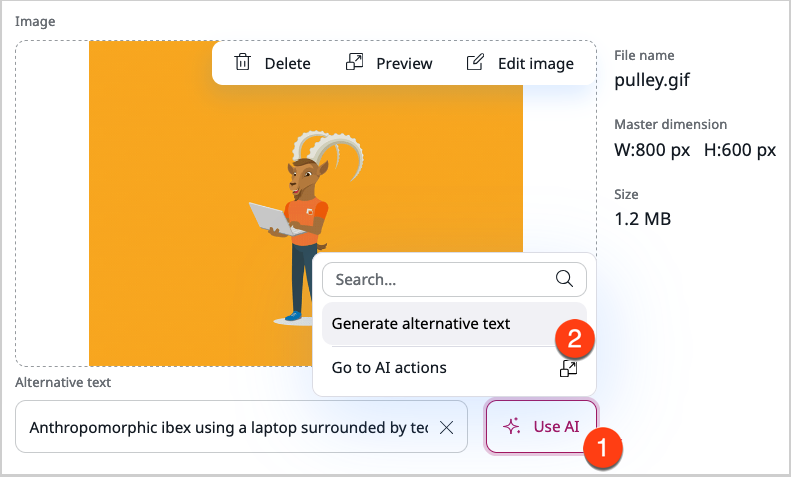

# Edit images

You can edit the image asset's properties.
You can also edit the image itself with the Image Editor.

!!! note "Editing tool availability"

    The editing tools are available when you work in the Back Office of your application, for example, to:

    - browse the Media root folder of the Content Tree
    - add an image or an image asset to a content item by selecting it from a Content browser or an Image picker
    - insert an image into a [Rich Text Field](create_edit_content_items.md#edit-rich-text-fields)

## Edit image asset

You can edit the image asset's properties, for example, to provide a different caption for the image, or change the alternative text for the image.
To edit an existing image asset, in the Back Office, the main menu, go to **Content** -> **Media** -> **Images**, choose the image asset that you want to edit and click **Edit**.

Here, you can:

- Change the name and caption for the image.

- Edit the image itself in [Image Editor](#edit-image-in-image-editor).

- Change the alternative text.

!!! note "Use AI to generate alternative text"

    If the AI Actions add-on has been installed and configured in your application, the **Use AI** button is visible.
    Click it to have the alternative text generated automagically.
    If you have a permission to access the **Admin UI**, the **Go to AI actions** button is also visible.
    By clicking it, you can quickly navigate to [AI actions configuration](work_with_ai_actions.md).

- Change the keywords assigned to the image.

!!! note "Use AI to generate alternative text"

    Tagging image assets helps keep the media library organized and enables searching images by tags in the DAM.

### Edit image in Image Editor

When you edit the image asset, you can edit the image itself by using the Image Editor that enables:

* image cropping
* image flipping
* setting a point of focus within an image

Image Editor is available whenever you see the **Edit** icon on the preview.

#### Flip

With the Flip feature you mirror the image along a horizontal or vertical axis.
Click either the **Horizontal** or **Vertical** button to flip an image.

#### Crop

With the Crop feature you can cut the image down to a desired aspect ratio and dimensions.
You can either choose one of the preset aspect ratio options (square, vertical or horizontal rectangle, or widescreen), or click **Custom**.

After you choose an aspect ratio, a grid appears on the preview.
You can then resize the grid to mark an area of the image that you want to be visible.
You can also enter the exact width and height values in the **Crop size** area. 

Click the tick icon to confirm the change or the **X** icon to cancel it and clear the preview.
When you confirm the change, the preview refreshes to display a cropped image.

!!! note "Saving changes"

    Confirming the crop operation does not mean that it has been saved.
    You must click **Save** to apply the changes to the original image.

#### Focal point

If your page contains an image that is larger that the current viewport, for example, when a user accesses the page from a mobile phone, 
you can select a point on the image that the view should focus on.

This way, a responsive image can be cropped to fit the viewport, 
so the area that contains the selected point is always visible.

!!! note

    Cropping to focal point is not automatic. The website's templates must be adapted for this to happen.
    See [Use focal point]([[= developer_doc =]]/templating/embed_and_list_content/render_images/#use-focal-point)
    in developer documentation for an example of implementing such cropping.

Click the **Show point** button to see a target on the preview.
Drag the target to a point on the image that you want to focus on.
Click the **X** icon to restore the original position of the target.

#### Undo changes

Click the left or right arrow button to undo or redo the most recent change.
Click **Reset image** to restore the original appearance of the image.

#### Save changes

Click **Save** to apply your edits to the original image and exit the Image Editor screen.
