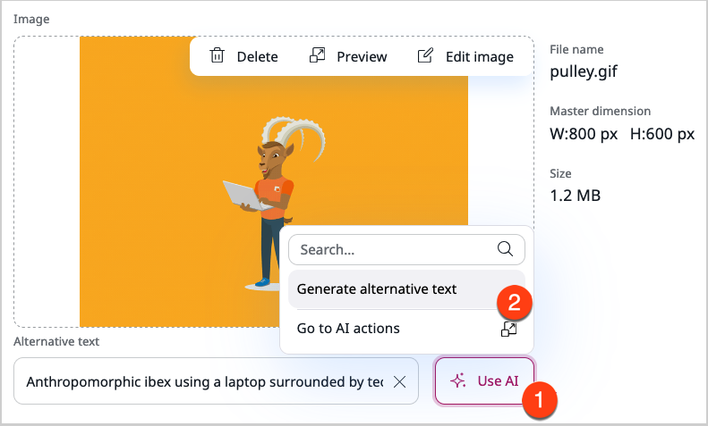

# Upload and store images

!!! note

    Some options may not be available depending on your configuration and permissions.

## Manage folders

By default, uploaded files are stored in the Media root folder of the content tree.
If you want to upload them to different location, navigate to the folder you want to upload to.

You can also [create additional folders](content_tree.md#add-folders) and sub-folders to further organize your images.

## Add image to create an image asset

1\. In the main menu, go to **Content** -> **Media** -> **Images**.

2\. In the upper-right corner, click **Create content**.

3\. From the available content types, select **Image** and click **Create**.

4\. Provide image title and optionally, a description.

5\. In the **Image** section, click **Upload file** and from the system browser, select an image.

6\. In the **Alternative text** field, provide an alternative description intended for users with vision impairment.

!!! note "Use AI to generate alternative text"

    If the [AI Actions](ai_actions.md) LTS update has been installed and configured in your application, the **Use AI** button is visible.
    If you have the required [permissions]([[= developer_doc =]]/permissions/policies/#ai-actions), you can click it to have the alternative text generated automagically.
    The **Go to AI actions** button can also visible to users with access to the **Admin UI**.
    By clicking it, you can quickly navigate to [AI actions configuration](work_with_ai_actions.md).

6\. To find images using tags, in the **Tags** field, enter keywords.

Tagging image assets helps keep the media library organized and enables searching images by tags in the DAM.

7\. Click **Publish**.

!!! note

    The maximum file size and file extension limitations may differ depending on your configuration.

<!--ARCADE EMBED START-->
<iframe src="https://demo.arcade.software/LpqBrmNLohIUwtMIl02M?embed&embed_mobile=tab&embed_desktop=inline&show_copy_link=true" title="Add and edit image" frameborder="0" loading="lazy" webkitallowfullscreen mozallowfullscreen allowfullscreen allow="clipboard-write" style="position: absolute; top: 0; left: 0; width: 100%; height: 100%; color-scheme: light;" ></iframe>
<!--ARCADE EMBED END-->

## Edit image assets and images

After you upload the image to create an image asset, you can adjust it according to your needs.
For detailed instructions on how to edit images, see the [Edit images](../image_management/edit_images.md).

## Copy, move or hide image assets

To learn how to effectively manage image assets, see [Move assets between folders](../content_management/content_organization/copy_move_hide_content.md)
section.

## Upload multiple images

To upload multiple images and create many image assets, you can use multi-file upload.

1\. In the Media section, go to the folder you want to upload to.

2\. Go to the **Sub-items** tab and click **Upload**.

3\. In the pop-up window, drag and drop files into the **Upload** area or click **Upload file** and select image files from the system browser.

## Add translations

If you work with multiple languages and want to use searching by languages in DAM, you can add translations to image assets.
You can replace the contents of all the fields that have values in the base language, for example, the description, or the alternative text.

To see how to add translations, go to [translate content section](translate_content.md#add-translations).
