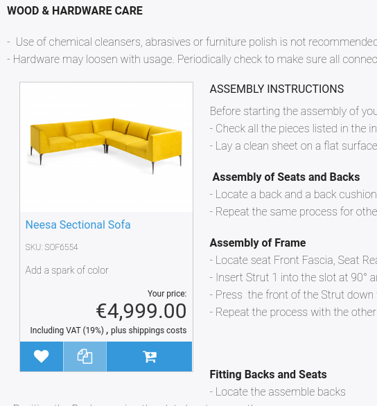
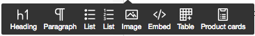
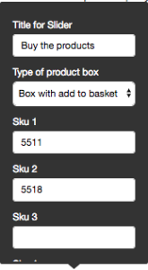
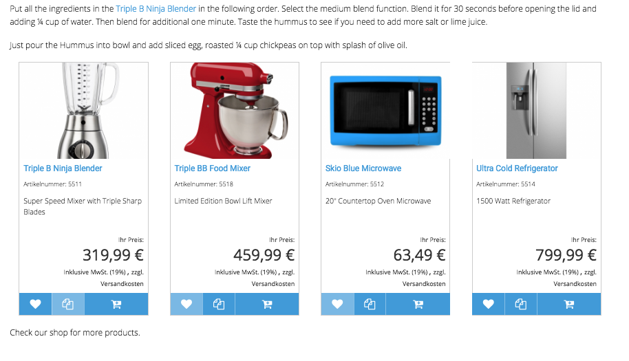
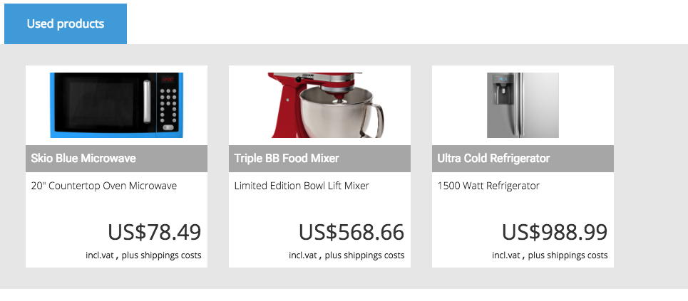

# Embed product

You can embed products in a RichText Field using the Embed function.
The product is embedded in a box including an add to basket button and a product image. The text floats around the product box.

## Embed a product slider

If you want to embed more than one product inside a RichText Field, use the Product card function:

### Box type

[[= product_name_com =]] offers the following types of box designs:  

- Slider

- Box with add to basket

### Slider title

The title is used only if you choose "Type of product box" as "Slider". It is displayed as a tab.
