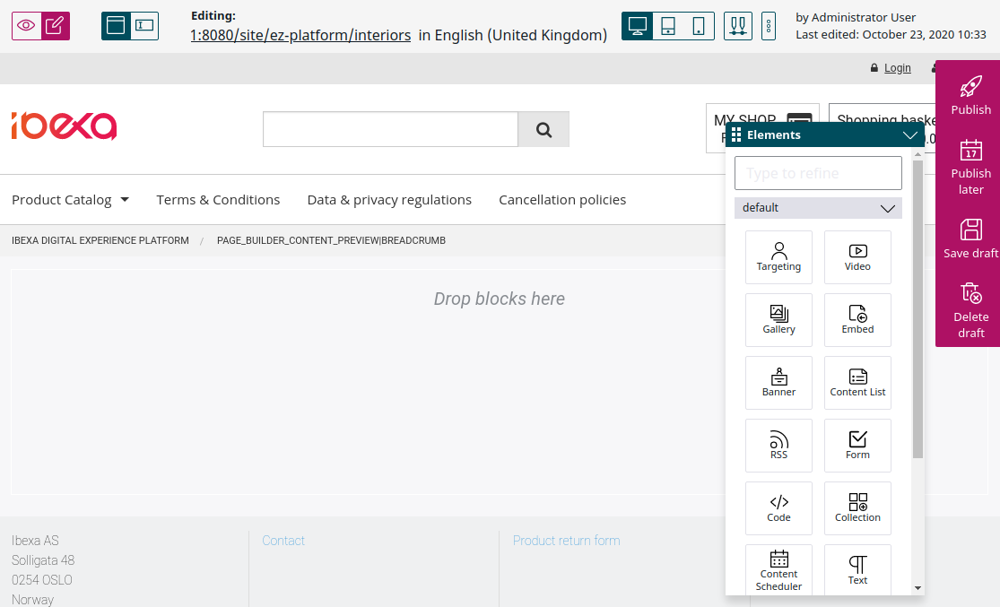
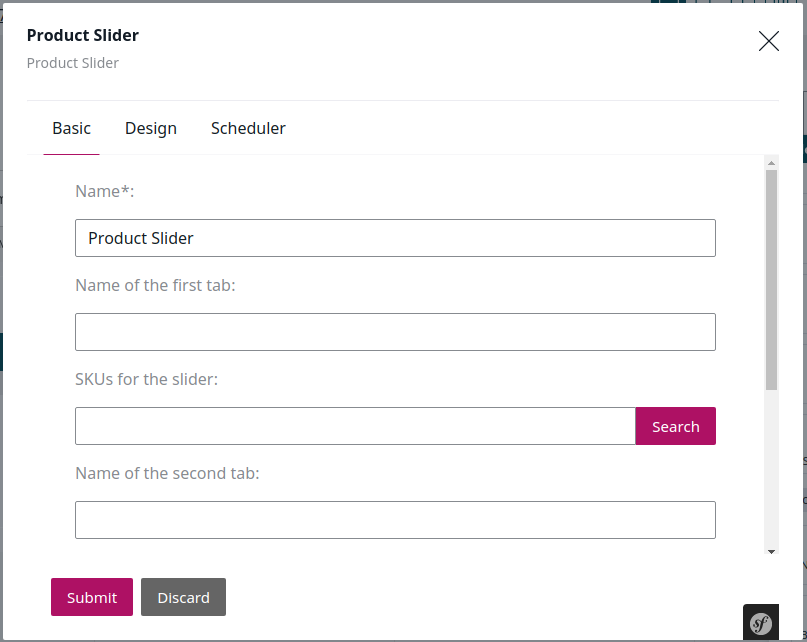
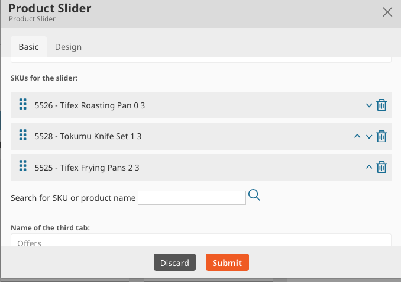
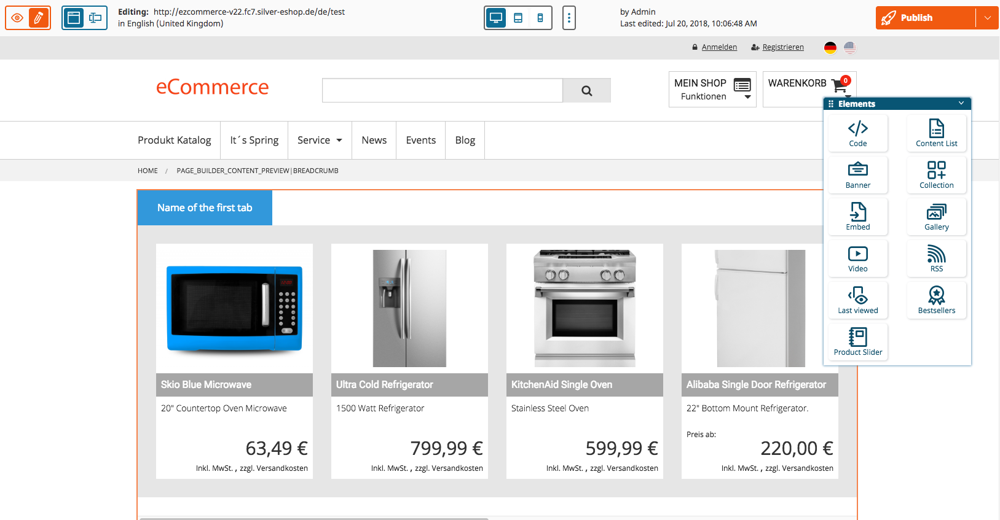
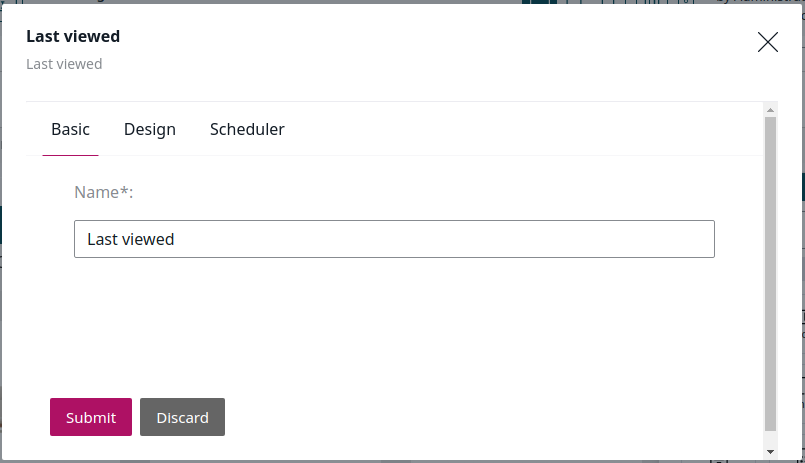
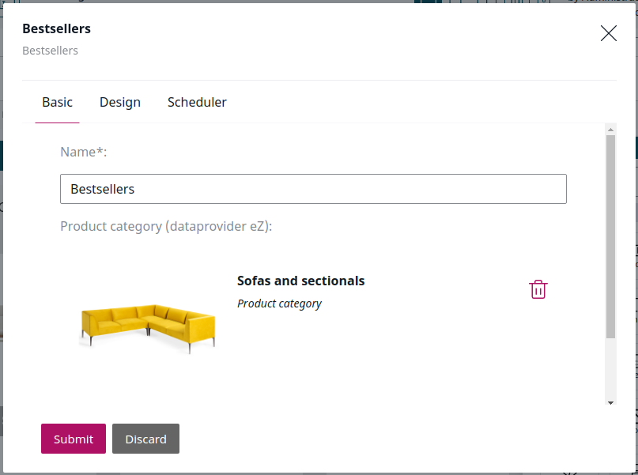
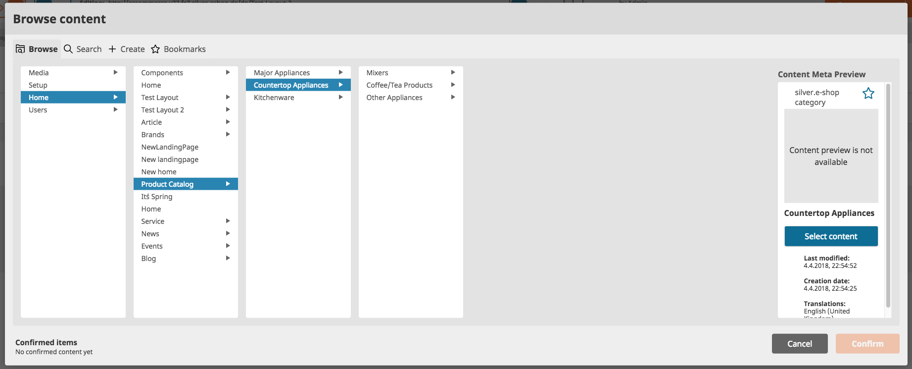
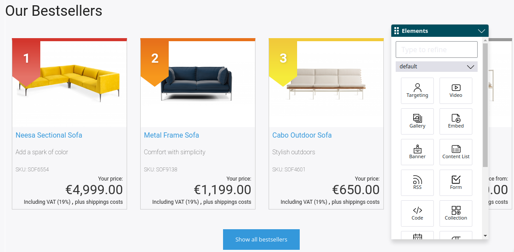

# Pages in the shop [[% include 'snippets/commerce_badge.md' %]]

[[= product_name_com =]] has at least one Landing Page which is the homepage. This document describes how to setup and modify Landing Pages. 

## Landing Page tool

[[= product_name_com =]] adds the following blocks to the blocks available in [[= product_name =]]:

- Last viewed
- Bestsellers
- Product Slider

## Product Slider

The Product Slider block creates a product slider section with up to three different tabs.

Add up to three different tabs and fill them with the SKUs of the products (you can search for SKU, a product name or a part of a product name).

Click **Submit** and you will see a preview of the slider.

## Last viewed

The Last viewed block displays a list of the last viewed products in a slider.

The block might not be visible in the edit mode but it will contain products in the frontend.

## Bestsellers

The Bestsellers block shows the bestselling products from a chosen category. This can be the whole product catalog or a subcategory.

To choose a category, click **Select content**.

