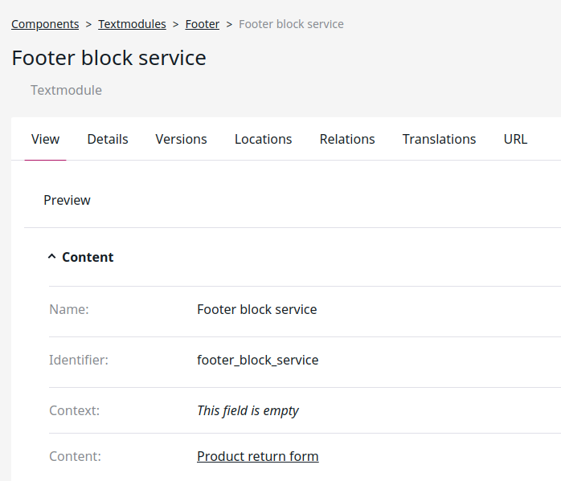
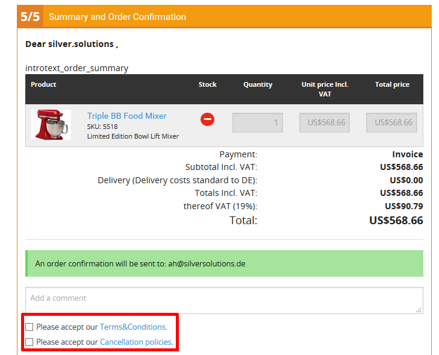
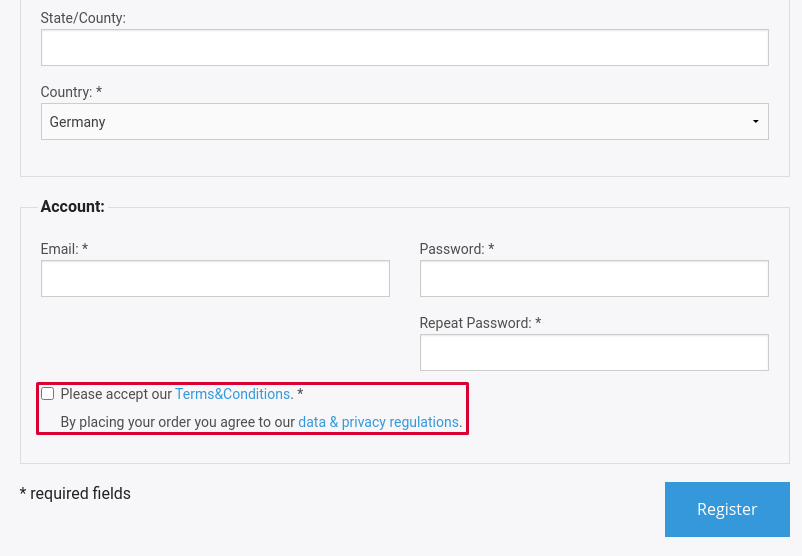
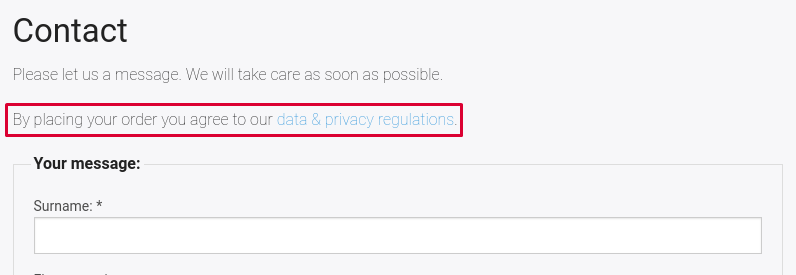

# Legal documents

You can link to legal documents and forms for the shop in various places, for example in the footer:

The legal documents are used at various places in the shop. The Terms and Conditions are shown as s full page or as a popup during the checkout process:

and in the register form:

The legal texts are linked in text modules that are used in various locations, e.g. the contact form.

The cancellation policy text is added to the confirmation email from the shop.
