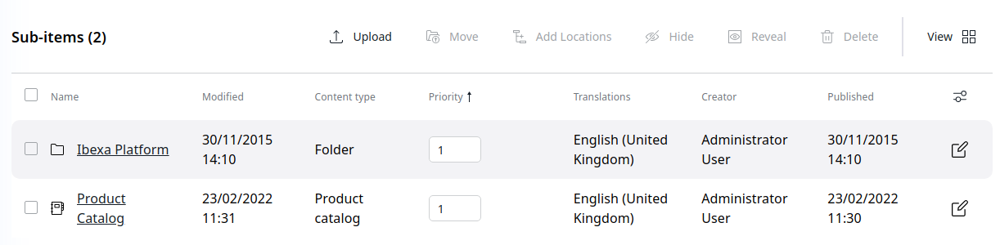

# Navigation structure [[% include 'snippets/commerce_badge.md' %]]

Click **Content** > **Content structure** to access the objects displayed in the top navigation

The following Content Types are supported:

- Article
- Folder (including Folder for news, events and blog post)
- Landing page
- Product category
- Product
- Feature link

!!! caution

    The main menu of the site displays elements only if the Priority is higher that 0.

Elements with lower Priority are displayed first.
