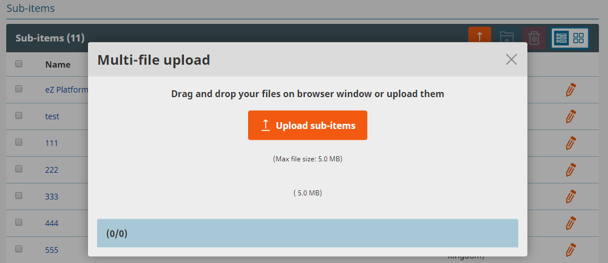
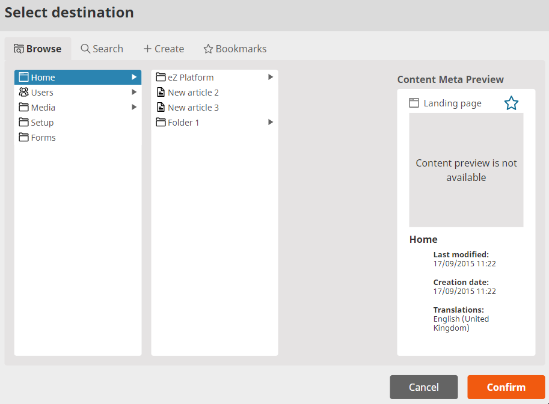
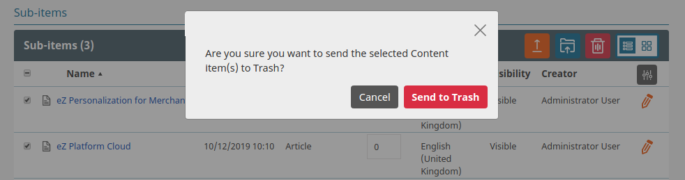

# Multi-file content management

Multi-file content management is a set of functionalities that enables you to upload, move and delete multiple binary files in a bulk.

### Multi-file upload

To add multiple items select 'Upload sub-items' button from 'Sub-items' top bar and choose all items you want to upload.
When a file is uploaded using multi-file upload, it is automatically stored in a Field of a new Content item.

### Multi-file move

To move multiple items select them and click 'Move selected items' from 'Sub-items' top bar.
Then choose a Location from 'Choose location' modal that opens up.
After choosing and confirming new Location all selected files are moved to it.

### Multi-file delete

To delete multiple items select them and click 'Delete selected items' in the 'Sub-items' top bar. Confirm your choice in the pop-up window with 'Send to trash' button.

