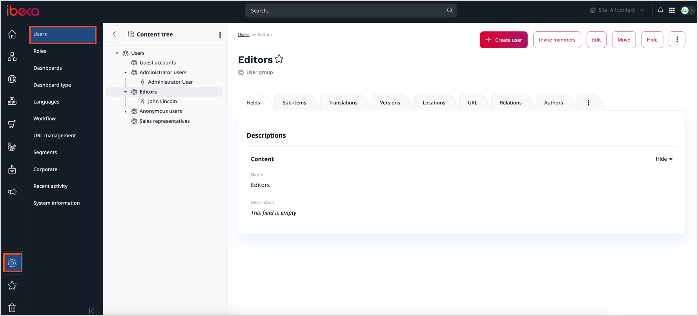

# Permission system

An overview of the permission system in [[= product_name =]] is best presented with an example.

### Example permission system

Let us assume you're managing a newspaper website.
Your crew consists of an editor-in-chief and several editors responsible for particular sections of the paper, for example, general news, local news, or sports.
You also have contributors who occasionally add new articles.
You want to give the editor-in-chief access to most parts of your website, but the individual editors only work with their own sections.
To the contributors you want to give the permissions to create new content, but not to modify or delete the existing content.

To have this setup, you need to create a number of different roles: Editor-in-Chief, different Editor(s), and Contributor.

Even if you plan on having only one editor-in-chief, it's good practice to create a user group to contain this user, and assign a role to it instead of assigning permissions directly to the user.

To each of these roles you need to assign proper policies, giving them the right to perform certain actions.

The Editor-in-Chief role would have the most policies (although you may want to reserve some more advanced permissions only for system administrators).
Regular Editors need policies allowing them to create, modify, and delete content.
Contributors can be given policies permitting them to only create content.

If you want to prohibit Editors from accessing content in newspaper sections other than their own, you can add limitations to their policies.
This means that instead of one Editor, you need to have separate roles for each editor profile, for example, Local Editor or Sports Editor.
All of these roles have the same policies, but to each policy you need to assign a limitation which would mean that the permission covers only one Section (for example, Sports Section or Local News Section) that the editor works in.

Aside from policies that define access to content items, there are also many other policy types concerned with administrating the system.
They cover actions, for example, activating new users, creating Sections, or modifying content types.

For more information about setting up a permission system, see [Work with permissions](work_with_permissions.md).
