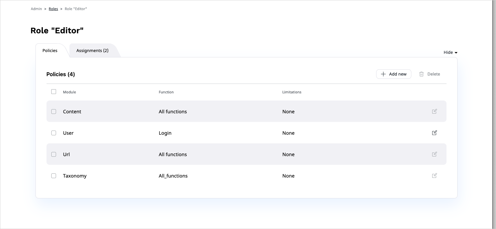
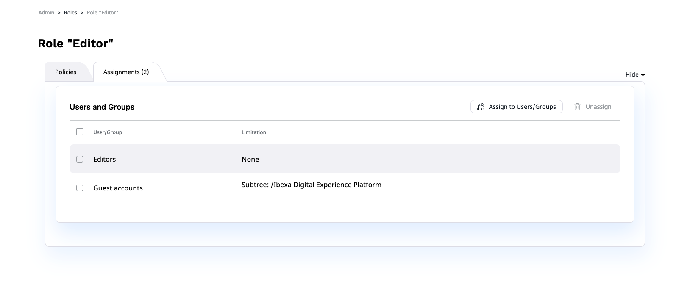

# Work with permissions

You can view and modify all [permissions](permission_system.md) by clicking **Roles** in the **Admin Panel**.

Click **Create** and provide a name to get an empty, unassigned Role.
Click **Save and close** to see a list of Policies that the Role has.
At the moment, there are none.
Click **Add**, select a Policy from the list and click **Save and close**.
You then may have an option to add Limitations to the Policy.
The available Limitations depend on the chosen Policy.
You can then return to a list of Policies by clicking **Save and close** or **Discard**.

After you are done choosing all Policies, you can assign the Role to users.
Go to the **Assignments** tab and click **Assign to Users/Groups**.
Here you can choose users and/or groups that will be assigned to this Role, with possible additional Limitations.
A User or user group may be assigned multiple Roles.

For a list of available permissions and limitations, see [Permissions]([[= developer_doc =]]/permissions/permissions/).
