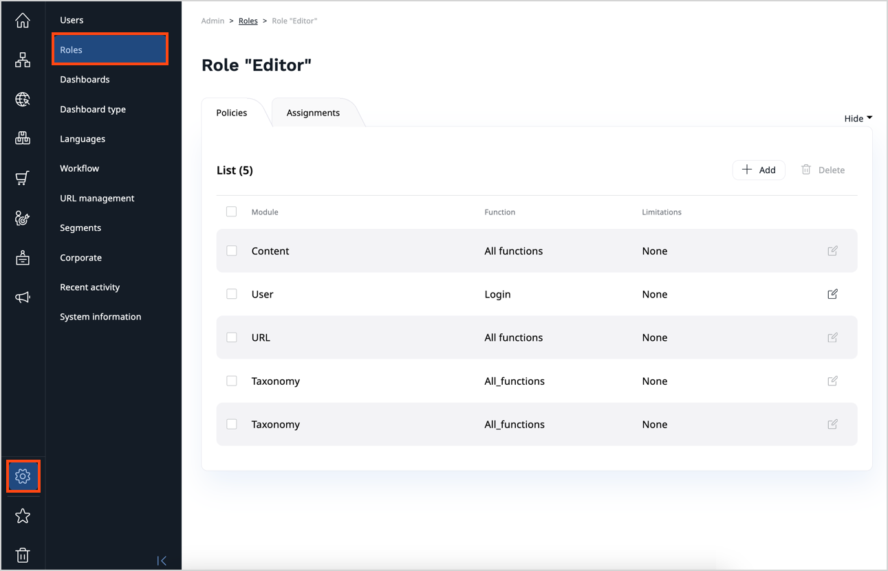

# Work with permissions

You can view and modify all [permissions](permission_system.md) by clicking **Roles** in the **Admin Panel**.

## Create a new Role

1. Go to **Admin** -> **Roles** and click **Create**.
1. Provide a name and click **Save and close** to see a list of Policies that the Role has.
1. Click **+ Add**, select a Policy from the list and click **Save and close**.

You then may have an option to add Limitations to the Policy.
The available Limitations depend on the chosen Policy.
You can then return to a list of Policies by clicking **Save and close** or **Discard**.

## Assign a Role to users

1. Go to **Admin** -> **Roles** and select a Role.
1. Go to the **Assignments** tab and click **Assign to Users/Groups**.
1. Choose users and/or groups to be assigned to this Role.
1. In the **Limitatons** area, select additional Limitations if necessary.
1. To discard your changes and close the window, click **Discard**.
1. To save your changes, click **Save and close**.

!!! note 

    A user or user group may be assigned multiple Roles.

For a list of available permissions and limitations, see [Permissions]([[= developer_doc =]]/permissions/permissions/).
