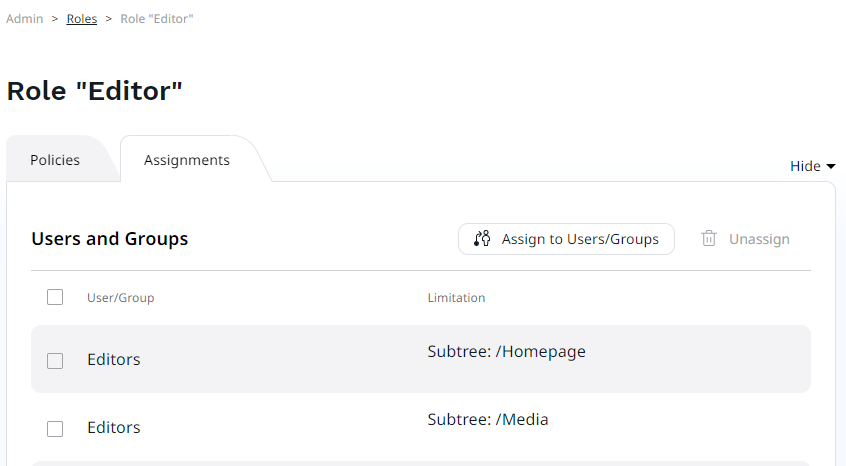

# Work with permissions

You can view and modify all [permissions](permission_system.md) by clicking **Roles** in the **Admin Panel**.

Select the plus button and provide a name to get an empty, unassigned role.
You can now see the list of Policies the Role has - at the moment, none.
Click the plus button again, select a Policy from the list and save it.
You then have an option to add Limitations to the Policy. 
The available Limitations depend on the chosen Policy.

After you are done choosing all Policies, you can assign the Role to users.
Go to the **Assignments** tab and click the assign button.
Here you can choose users and/or groups that will be assigned this Role, with possible additional Limitations.
A User or User Group may be assigned multiple Roles.

For a list of available permissions and limitations, see [Permissions]([[= developer_doc =]]/permissions/permissions/). 
