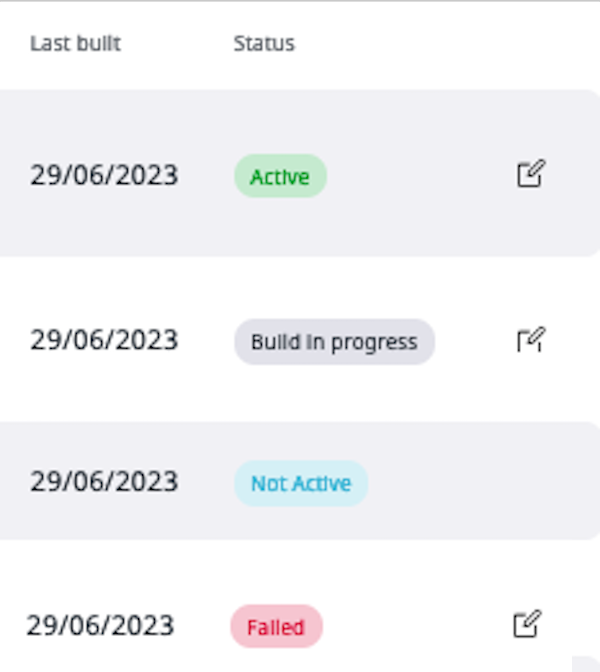

# Configure models

If your [user role](../permission_management/permissions_and_users.md) has 
the `Personalization/Edit` permission that includes your website, you can modify 
model settings according to your requirements.

Go to **Personalization** > **Models** to see a page that lists all available 
[models](recommendation_models.md) and provides detailed information, such as the 
[scenarios](scenarios.md) that use each model, or when the model was last triggered.

Here, you can click the **Edit** icon to access the model configuration screen and modify 
the settings, for example:

- A timeframe over which the algorithm gathers [events](event_types.md) that are used in the calculation
- [Submodels](recommendation_models.md#submodels) that can narrow down the list of model results
- [Segments](../segment_management#configure-segments) that allow getting personalized content suitable for particular user groups
- A list of items included or excluded from the model

For more information and a list of model types, see [Recommendation models](recommendation_models.md).

### Advanced model configuration

Most of the models provide additional configuration parameters, which enable customization. 

The parameters supported by different model types are described in the table below. 
Some models support [submodels](recommendation_models.md#submodels). 
Additional differentiation criterion is the supported context. 
If a model requires context, it can only be linked to scenarios that provide 
the necessary context.

|Model type|Available parameters|Submodel support|Context|
|---|---|---|---|
|Popularity|Relevant event history defines the time period for which the statistics must be analyzed. Depending on the type of product, it can be between several months and several hours. Fast event ageing can be used to weight newer events higher than older events.|yes submodels based on category are enabled by default|not needed|
|Also clicked/purchased / Ultimately bought|Both also clicked and ultimately purchased models allow defining the relevant event history.|yes, manual|required (either context items or user data)|
|Recently added|This model requires the maximum age for the items that should be recommended by this model.|yes|not supported|
|History-based|The type of the history (CLICK-history or BUY-history) must be specified.|no|required (user data)|
|Editor-based|The list of recommendations must be created manually by the editor.|no|not supported|
|Blacklist|The list of items that should be excluded from the recommendations must be created manually by the editor.|no|not supported|

Do not confuse event history age with item age. 
History age is the age of the user's footprint (for example, "User clicked on the product A 
two weeks ago"). 
Item age is the time over which the item is available in the shop ("How new is the item"). 
The history is recorded automatically based on [event](event_types.md) tracking. 
The item catalog must be filled separately as a result of [data import](content_import.md).

### Trigger model build

Models on the Personalization server side are configured to build at intervals, 
for example, every 24-hours.
For models which require computation (all [popularity](recommendation_models.md#popularity-models) and [collaborative models](recommendation_models.md#collaborative-models)), 
you can manually trigger the build, for example, after you modify model settings.

To do this, go to **Personalization** > **Models**.
Click the edit icon next to the model name, make necessary changes, and click 
the **Trigger model build** button.
On the list of models, the model's status changes to `Build in progress`. 
When the build come our successful, the status changes to `Active`.

Possible model statuses:

- **Active** - model is successfully built
- **Not active** - new model which hasn’t been triggered or used yet, or model that is added to the scenario, calculated and then removed from the scenario
- **Build in progress** - model during the building process
- **Failed** - there is no data to build the model or some error occurred, building failed
