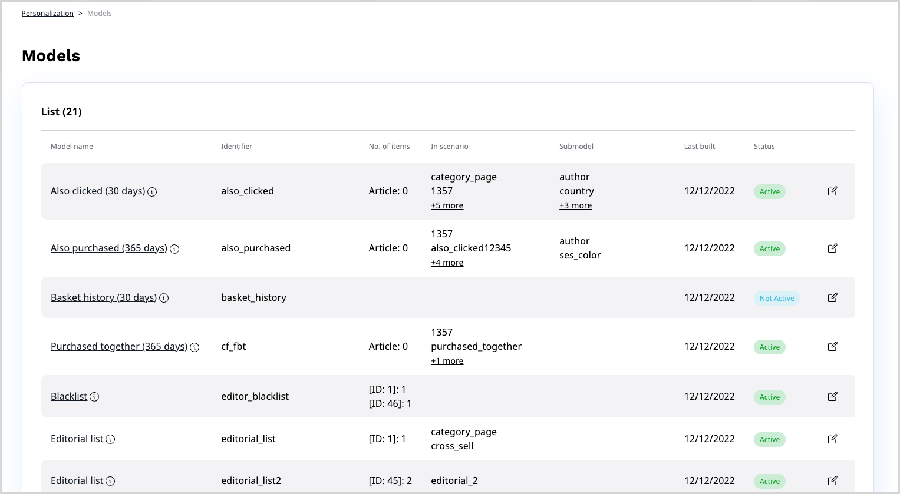

# Configure personalization

In the Back Office, you can you can review the configuration that controls 
the Personalization service.
If your [user role](../permission_management/permissions_and_users.md) has 
the `Personalization/Edit` permission that includes your website, you can modify 
the settings according to your requirements.
To do this, navigate to one of the pages mentioned below and edit the item that you want to modify.

!!! note "Host multiple websites"

    If you have permissions to access several websites hosted on an [[= product_name =]] 
    instance, you can use the selector field to switch between views for each 
    of these websites.

## Models

The **Models** page lists all available models and provides detailed information, 
such as the scenarios or segments that use each model or when the model was last triggered.
Models come predefined with the service, based on the arrangements that your 
organization makes with Ibexa when defining the initial configuration.
You can request that a specific model is created by contacting customer support.

Here, you can click the **Edit** icon to access the model configuration screen and modify 
the settings, for example:

- A timeframe in which the algorithm gathers events that are used in the calculation
- Submodels that can narrow down the list of model results
- Segments that allow getting personalized content suitable for particular user groups
- A list of items included or excluded from the model 

For more information, see [Recommendation models](recommendation_models.md).

## Scenarios

The **Scenarios** page contains a list of all available scenarios.
It also provides additional information, such as a description of each of the scenarios, models 
that the scenario uses, or indication of whether the scenario is operational or not.

 Click the **Edit** icon to access the scenario configuration screen, where you can configure 
 a number of settings, for example:
 
 - The type of content used to as input data and recommended items
 - Primary, secondary and provisional models used to calculate results
 - User profile-based settings, boost settings and other [filters](filters.md) that can be used to eliminate or promote specific results
 
Here, you can also click the **Preview** icon to see an example of recommendations that 
the scenario returns.
You may need to provide additional information to see the results.

For more information, see [Scenarios](scenarios.md).
