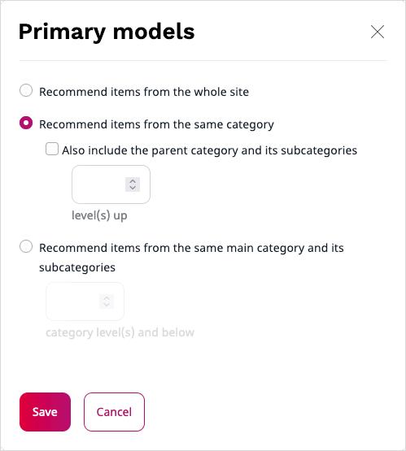

# Configure scenarios

If your [user role](../permission_management/permissions_and_users.md) includes 
the `Personalization/View` Policy, you can go to **Personalization** > **Scenarios** 
and see a page that lists all available scenarios. 
It also provides additional information, such as a description of each of the scenarios, 
[models](recommendation_models.md) that the scenario uses, or indication of whether 
the scenario is operational or not.

To modify the scenarios to suit your needs, you must have the `Personalization/Edit` Policy.
You can then click the **Edit** icon next to the name of the scenario.

!!! note

    You may have permissions to access several websites hosted on an [[= product_name =]], 
    [with independent results returned for each of these websites](use_cases.md#multiple-website-hosting).
    If this is the case, use the selector field to switch between views for each of these websites.

In the scenario configuration screen, you can configure  a number of settings, for example:
 
 - The [type of content](content_types.md) used as input data and recommended items
 - A strategy consisting of primary, secondary and provisional models used to calculate results
 - User profile-based settings, boost settings and other [filters](filters.md) that can be used to eliminate or promote specific results

 
## Configure basic settings

Provide a name and an identifier for the scenario. 
Select a single input type and at least one output type. 

## Configure strategy

Modify the strategy by dragging model boxes between the **Models** area that lists 
all available models and the **Strategy** board. 

You can arrange models within a scenario board by importance. 
To make it possible, strategies have several levels.
Add several models to every strategy level to avoid empty or insufficient recommendation results.

!!! note 

    Models from each level are used in parallel and strategy results contain an equally 
    distributed mixture of both model results. 
    If models from one level do not return enough results, models from the 
    subsequent levels are used.

From the **Data type** and **Context** drop-downs, select the required options to group items based on supported data types for the model.
You can choose between **Submodels** or **Segments** data types.

If selected models support additional differentiators, you can apply them here. For more information about available model settings, see [Advanced model configuration](recommendation_models.md#advanced-model-configuration). 

!!! note 

    By default, models doe not use submodels or segments.
    Changes you make here apply only in the context of the current scenario.

## Configure filters

For every recommendation scenario, you can define a set of filters.
With filters you can eliminate, demote or promote specific recommendation results.

For a complete list of available general filter types and their meaning, see [Filters](filters.md#user-profile-based-filters).

For each of the importance levels from the strategy configuration matrix, you can 
configure category filters. 
Click the **Configure** icon and make necessary changes.

For a detailed description, see [Category path filters](filters.md#category-path-filters).

## Configure cross content type recommendations

Cross content type option is used to combine best recommendation items from 
different [types of content](content_types.md). 
It applies to scenarios which have more than one output type configured.

To get multiple output types in the recommendation request, perform the following actions:

1\. Go to **Personalization** -> **Scenarios**.

2\. Click the **Edit** icon next to the scenario for which you want to set cross content type recommendations.

3\. In the **Output type** multiselect field, select the types for which you want to get recommendations in the request.

It contains a list of all types of content exported for the specified customer ID.

4\. Next, go to Preview Scenario.

5\. From the **Output type** drop-down, select **All**. 

The **All** option automatically appears after types of content are selected in the scenario settings.

!!! note

    The **All** option can be translated according to your needs.

## Preview scenario results 

Go to **Personalization** > **Scenarios** to see a page that lists all available scenarios. 
Click the **Preview** icon to see an example of recommendations that the scenario returns.
You may need to provide additional information to see the results.
