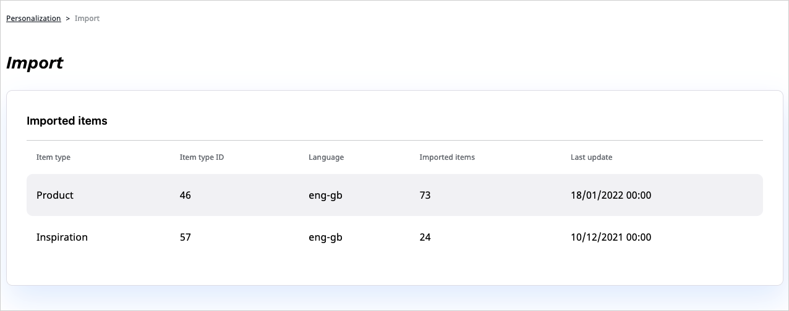

# Import source data

Before the Personalization service can generate relevant recommendations, it must be fed with data that relates to [content](content_types.md) items/products that are monitored, and [event](event_types.md) tracking information.
Some [scenarios](scenarios.md) return better results if provided with user data.

Data import operations are configured at the developer level, based on the arrangements that you make with [[= product_name_base =]].
Content item import jobs fetch data from the recommendation client, which tracks events, to the Personalization service.
The Personalization service then processes the events and calculates the recommendations.

!!! note "Host multiple websites"

    If your installation [hosts multiple websites](use_cases.md#multiple-website-hosting) and returns separate recommendations
    For each of these websites, you must import data separately.

## Content data import

The Personalization service can accept data import in a several ways.
For example, one can load an exported file to the Personalization service from a specified location. 
This type of import is intended to upload big portions of information, and can be used to perform a weekly update of the whole product catalog.

For detailed information about content data import, see [Export item information]([[= developer_doc =]]/personalization/enable_personalization/#export-item-information) and [Content API]([[= developer_doc =]]/personalization/api_reference/content_api/) in developer documentation.

## User data import

The Personalization service has little information about the users of the website.
Additional attributes, such as the user's age or home city, might help the service generate a successful recommendation, for example, by enabling the use of [boost filters](filters.md#boost-filters).
User attributes could be retrieved based on the external user ID.
However, it's rarely possible to combine the external user ID within the user's attribute set.

For more information about user attribute import, see [User API]([[= developer_doc =]]/personalization/api_reference/user_api/) in developer documentation.

## List of import operations

In the back office, from the main menu, under **Personalization**, you can access the **Import** page that displays a list of historical import operations and their details, such as the number of imported content items/products, their type and language.

