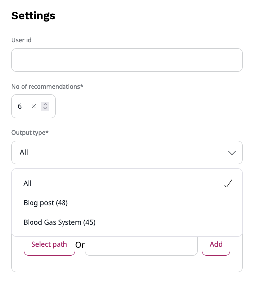

# Cross content type recommendations

Cross content type option is used to combine best recommendation items from different content types.
It applies to scenarios which have more than one output type configured.

## Configure scenario

To get multiple output types in the recommendation request, perform the following:

1. Go to **Personalization** -> **Scenarios**.
1. Click the **Edit** icon next to the scenario you want to set cross content type recommendations.
1. From the **Output type** multiselect field, select the types you want to get recommendations for in the request.
    It contains a list of all content types exported for the specified customer ID.
1. Next, go to Preview Scenario.
1. From the **Output type** drop-down, select **All**. 

The **All** option automatically appears after content types are selected in the scenario settings.

!!! note

    The **All** option can be translated according to your needs.

## Use cross content type in Page Builder blocks

When scenarios are configured to display cross content type recommendations, you can use them in the following Page Builder blocks: Dynamic targeting and Personalized.

To get all output types in the [Personalized block](../site_organization/working_with_page.md#personalized-block), in the Page Builder mode perform the following:

1. In the block settings, set the scenario with configured crosscontent types output.
1. Next, from the drop-down **Select a Content Type to be displayed**, select **All**.
1. Increase the display limit to make sure all recommendations are shown.
1. Click **Submit**.

To get all output types in the [Dynamic targeting block](../site_organization/working_with_page.md#dynamic-targeting-block):

1. In the block settings, set the scenario with configured crosscontent types output.
1. From the **Output type** drop-down, select **All**.

1. Next, set the rules according to your needs.
1. Click **Submit**.

For more information, see [Parameters](https://doc.ibexa.co/en/latest/guide/personalization/enabling_personalization/#parameters) in the developer documentation.