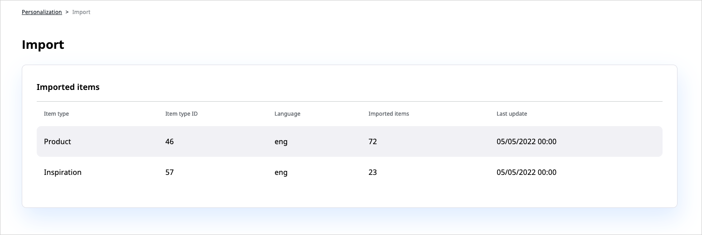

# Dashboard

The administration dashboard is the entry point to configure and control the Personalization Solution. 
It is split into several sections:

- The top section contains tiles with the most important metrics, such as a number of recommendation calls, number of successful recommendations and so on.
- The diagrams section presents statistical information on how the recommendation engine is used and how successful - depending on the KPIs - recommendations are.
- The bottom section is made up of tables with detailed information, such as the most popular items, or top purchases.

## Statistics

The diagram part consists of four main blocks:

- Collected events:
    The input data (clicks, buy, clickrecommended, ...) which is going into the recommendation engine for the customer website. For more information, see [Event Types](event_types.md).
- Recommendation calls:
    The number of recommendation calls (total and per scenario).
- Revenue:
    The effectiveness of recommendations regarding clicked recommendations, revenue through recommendations.
- Conversion rate:
     An absolute number of converted/sold recommendations.

The conversion (or click-through) rate is an **indicator of the acceptance** and therefore 
the **quality of recommendations**. 
It is calculated as follows: The total number of clicked recommended products divided by the amount of 
recommendation calls. 
This statistic only delivers reliable information if the tracking is implemented correctly.

The revenue-through-recommendations is a **monetary value** which was additionally created by recommendations. 
It is calculated as follows: If a user buys product A and has clicked on it as a recommendation within 
30 minutes before we assume it was sold through a recommendation.

Purchased recommendations is the **plain number of sold recommendations** without any revenue/price information.

All statistical information can be downloaded in MS Excel format. 
The timeframes depend on the selection of the diagram period (day, week, month, 3 months and year) but 
can also be customized.

## Configuration Settings

The top bar provides you with access to the following pages, where you can configure the 
Personalization Solution.

### Models

The **Models** tab lists all available models and provides detailed information, such as the scenarios that use each model or when such model was last triggered.
You can also click the **Edit** icon to access the model configuration screen.

For more information, see [Recommendation Models](recommendation_models.md).

### Scenarios

The **Models** tab lists all available scenarios and additional information, such as 
a description of each of the scenarios, models that it uses, or whether it is operational or not.
You can also click the **Preview** icon to see an example of recommendations that the scenario 
returns or the **Edit** icon to access the scenario configuration screen.

For more information, see [Scenarios](scenarios.md).

### Import/Export

You can see a list of import operations and their details here.
Item import jobs are used to fetch data from an external system. 

