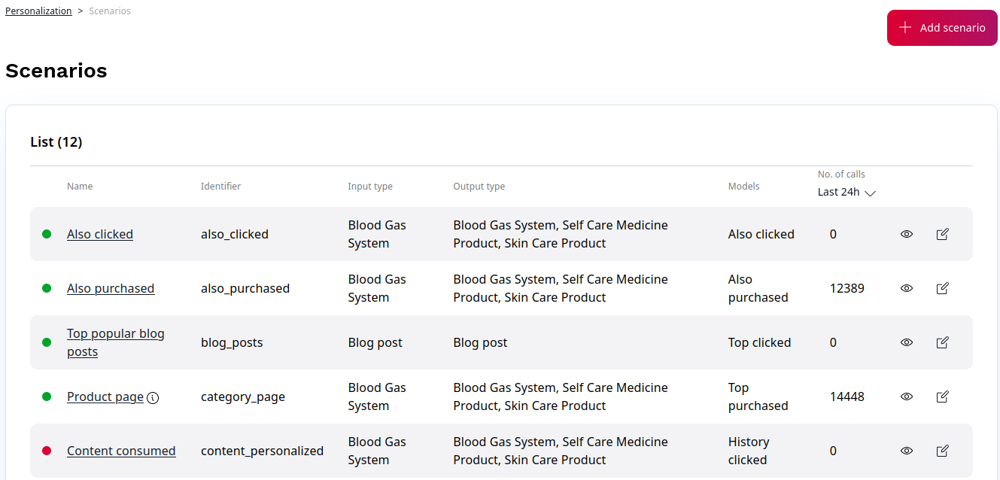

# 3. Dashboard

The administration dashboard is the entry point to configure and control the Personalization Solution. It is split into two main sections:

- The top section contains diagrams representing statistical information on how the recommendation engine is used and how successful - depending on the KPIs - recommendations are.
- The lower section is made up of many configuration tabs. It contains at least the Scenarios and Added revenue information. Depending on the license and registration information there is also a tab for Plugin and Content Import settings.

## Statistics

The diagram part consists of three main blocks:

- Collected events:
    The input data (clicks, buy, clickrecommended, ...) which is going into the recommendation engine for the customer website (see [4. Event Types](event_types.md) for more information).
- Recommendation calls:
    The number of recommendation calls (total and per scenario)
- Clicked recommendations, Purchased recommendations and Revenue by recommendations:
    The effectiveness of recommendations regarding clicked recommendations, revenue through recommendations and absolute number of converted/sold recommendations

The conversion (or click-through) rate is an **indicator of the acceptance** and therefore the **quality of recommendations**. It is calculated as follows: The total number of clicked recommended products divided by the amount of recommendation calls. This statistic only delivers reliable information if the tracking is implemented correctly.

The revenue-through-recommendations is a **monetary value** which was additionally created by recommendations. It is calculated as follows: If a user buys product A and has clicked on it as a recommendation within 30 minutes before we assume it was sold through a recommendation.

Purchased recommendations is the **plain number of sold recommendations** without any revenue/price information.

All statistical information can be downloaded in MS Excel format. The timeframes depend on the selection of the diagram period (day, week, month, 3 months and year) but can also be customized.

## Configuration Settings

### Revenue details

This tab shows you when recommendations were bought and how much time passed between the click on the recommendation and the buying event.

### Scenarios

The scenario overview shows all available scenarios. Additional info like a description and the delivered recommendations in the selected timeframes are also presented.

Scenarios with green status bars indicate that all models can provide recommendations. Yellow bars indicate that only a part of the configured models can provide recommendations and red ones indicate that no recommendations can be delivered. See [8. Scenarios](scenarios.md).

### Models

This tab allows you to see all available models and configure them, see [6. Recommendation Models](recommendation_models.md) 

### Preview

This tab shows you recommendation preview based on a Scenario.

### Plugins

If a plugin was used to register the service, specific settings can be configured under **Plugins**.

### Import/Export

Item import jobs are used to fetch data from a customer system. Data-mappings and schedule times are defined here.

