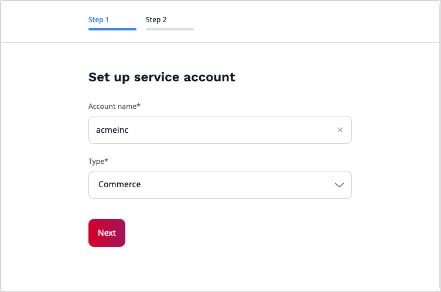
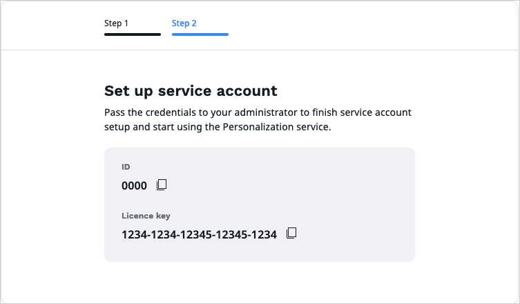

# Enable personalization

The Personalization service is based on a client-server architecture.
The recommendation client that is part of your installation must connect to the server that is run and maintained by [[= product_name_base =]].
To use the service, you must make arrangements with [[= product_name_base =]] to define the initial configuration, and then get and set up authentication parameters.

## Request access to the server

After you get the initial configuration from [[= product_name_base =]], you must accept the terms and conditions of the Personalization service and create an account to get access to the server.

### Create account

First, you must accept the terms and conditions of the Personalization service.

1\. Go to the back office.

2\. On the left panel, go to **Personalization** > **Dashboard**.

3\. On the welcome screen, provide the following details:

- A full name of the person responsible for accepting the terms and conditions
- An email address to which you want the confirmation to be sent
- An installation key that can be found on the **Maintenance and Support agreement details** page in the service portal

4\. Select the **I have read and agree to the Terms and Conditions** checkbox, and then click **Submit**.

5\. Next, enter the project name or your brand name.

6\. From the **Type** drop-down, select the account type (Commerce or Publisher).

7\. To proceed, click **Next**. After a few moments, a screen with your ID and license key displays.

## Set up service parameters

When you receive the credentials, ask your administrator to:

- [add the credentials to your configuration]([[= developer_doc =]]/personalization/enable_personalization/#set-up-customer-credentials)
- [configure events that you wish to track]([[= developer_doc =]]/personalization/enable_personalization/#set-up-item-type-tracking)
