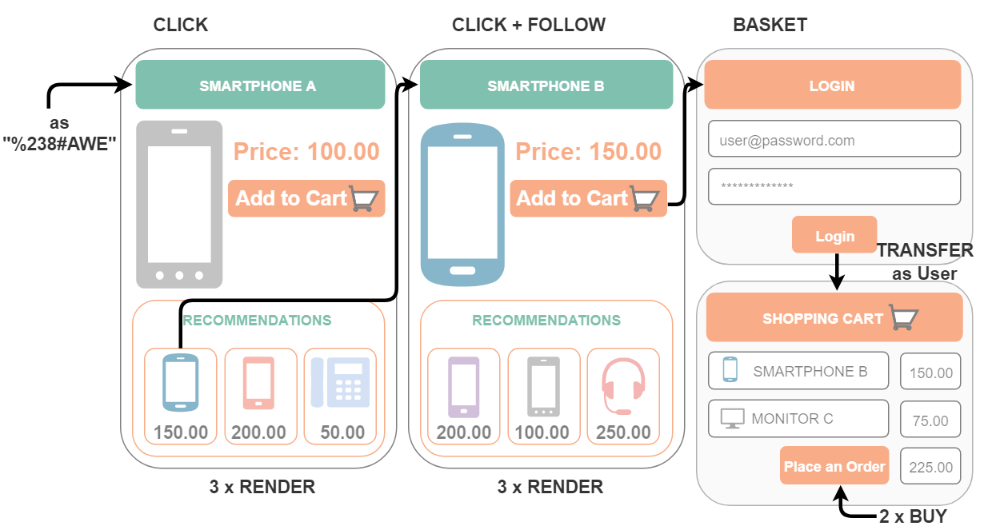

# Event types

Before it can generate implicit recommendations, the recommendation engine must collect events and calculate the results recommendations based on user behavior. 
The most important events collected by the engine are click and buy events. 
They are enough for providing basic recommendations. 
There are some additional events for creating more complex scenarios and providing statistics about 
acceptance of recommendations, such as conversion rate or revenue. 

The table below lists all possible events used in the system.

|Event|Description|
|---|---|
|CLICK|Sent to the recommendation engine when a user opens a page on the website.|
|BUY|Sent if something was bought.|
|CONSUME|Similar to the BUY event but without a payment. Designed for content publisher sites. Sent when an article or a web page is consumed (read or watched).|
|RENDER|Sent when a recommendation is shown on the web page. This information is used by filters to suppress repeated recommendations of the same item.|
|FOLLOW / CLICKRECOMMENDED|Sent when a user clicks the recommended product. Allows building acceptance statistics.|
|TRANSFER / LOGIN|A special type of event to deal with a user login after the user already surfed on the web page anonymously. Always sent when the identifier of the user changes. As a result, the anonymous history of the user is transferred to the new identifier. This happens automatically in the recommendation engine.|
|BASKET|Sent when the user adds the specified product to the shopping cart. Enables creating recommendations for products that customers are interested in but ultimately did not buy for some reason.|
|BLACKLIST|Allows a user to suppress currently displayed recommendations. When the recommendation engine receives this event, the product or content item is no longer recommended to the specified user. By default, recommendations are suppressed for one year.|
|OWNS|Same as BUY, but does not influence the statistics. Can be sent when a user already owns the product that was purchased somewhere else, to avoid recommending it again.|
|RATE|Additional models can be created with this type of events. Allows building recommendations not only for implicit tracking events like "click" or "buy", but also for events with explicit value like "rated" or "liked". These events need additional integration into the web page to allow the user to give an appropriate feedback. The event is triggered as a result of this user feedback.|

All events require the current user ID and the ID of one or more context items. 
Some events require additional information. 
Sophisticated algorithms and result filtering require event types with additional parameters. 
The table below provides a brief overview of additional parameter information.

|Event|Additional information|
|---|---|
|CLICK|Category path of the product a customer clicked on can be attached to the event. It is an alternative way to provide this information for a product without having a catalogue/export. Ignored if an export is available to be fed into the recommendation engine.|
|BUY|The price that a user paid for the product. This is an important parameter for the statistics. For revenue statistics, it must be sent together with a quantity of the products bought.|
|FOLLOW / CLICKRECOMMENDED|The scenario which provided the recommendations must be sent in this event.|
|RATE|The rating (for example 1 to 5 stars) can be sent as an additional parameter.|
