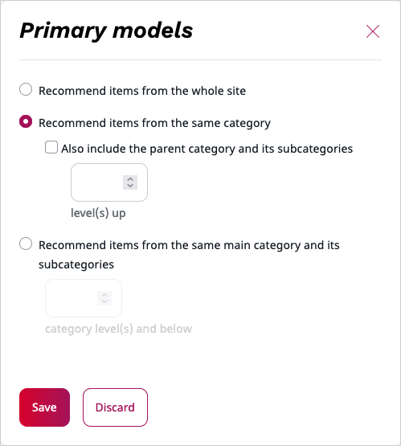
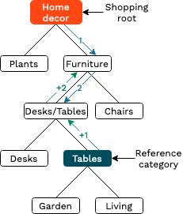
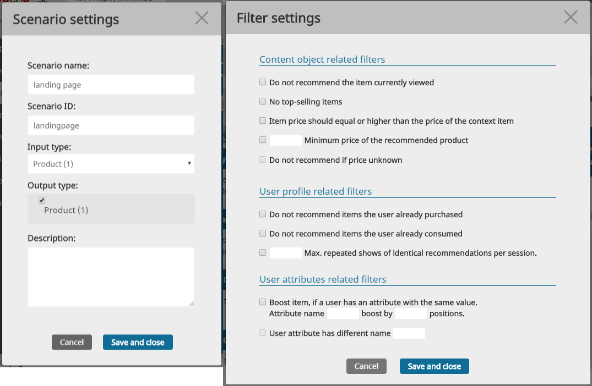
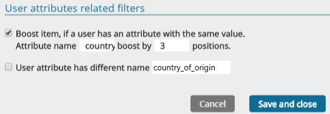
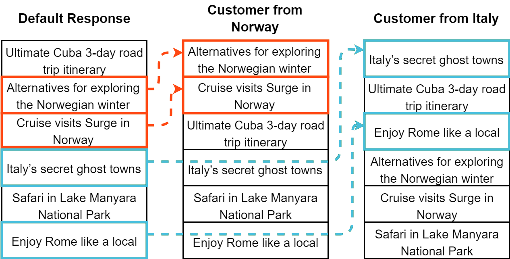

# 7. Filters

## Category Filter

For every row in the scenario configuration you can define a category filter. If the filter is activated, only items from the specified category will be recommended. The actual category used to filter on is specified in the parameters of each recommendation request.

There are two ways to specify a category in a recommendation request:

- No context items, but the **category explicitly provided in the request**. This recommendation call is usually placed on the category overview page for getting most popular products of the selected, actual category (in the figure it is called "reference category").
- **Context items are provided** and categories of all context items are used for the request. This approach is recommended only if it is technically impossible (or too complex) to provide the category information explicitly.

Depending on configuration of the filter, the recommendation engine can take different approaches to finding the actual set of categories the products will be recommended from.

The following example explains the different possibilities in more detail.

Depicted below is the configuration dialog - available in the GUI on the right side of the model configuration tab in a scenario (see [Advanced Model Configuration](recommendation_models.md#advanced-model-configuration)) - and category structure which is basically the site navigation:

The table below lists the possible configurations and categories that recommended items will be fetched from.

In all examples we assume that the category received in the request is **"/Furniture/Desks&Tables/Tables"**.

|category Path Filter configuration|Target categories to fetch recommended products from|
|---|---|
|Always recommend products from the whole shop. Do not use category path for filtering.|All categories ("Plants", "Furniture" and below).|
|Recommend only products from the same category ("also include..." is not checked).|Category "Tables" and all the sub-categories below ("Garden tables" and "Living room tables").|
|Recommend only products from the same category. "Also include parent category" is set to 1.|Category "Desks/Tables" and below including "Desks", "Tables" and all their sub-categories.|
|Recommend only products from the same category. "Also include parent category" is set to 2.|Category "Furniture" and below.|
|Recommend products from the same main category and its subcategories from level 1.|Category "Furniture" and below.|
|Recommend products from the same main category and its subcategories from level 2.|Category "Desks/Tables" and below.|
|Recommend products from the same main category and its subcategories from level 3.|Category "Tables" and below.|

It is possible to provide multiple reference categories (both in the request and over the context item or items). In this case the superset of the recommendations will be returned. The results are sorted based of global weight of the recommendations. Depending on the popularity of the categories the more popular category will most probably push the less popular categories out of the results.

If the recommended item is located in more than one category, it will be recommended if at least one category is requested in this recommendation call.

### Multiple Categorypath dimensions for popularity models

The categorypath parameter is very powerful in its usage. The default approach is to represent content in the navigation-based structure of a website which is used by default. If there is a need to represent available items of a website in different dimensions (taxonomies) it is possible to do this out-of-the box simply by enriching the categorypath information of an item, without changing any settings in the recommender engine.

To make it a bit clearer let's take a look at the following example: In the above mentioned shop both furniture and plants are sold and they are structured based on site navigation. Typically customers would look for computer desks and get a list of recommendations of all computer desks in the shop. If desired, the recommendation engine could also use another dimension for filtering recommendations, for example a "brand" dimension. In this case the user would get recommendations for all items from the same "brand".

In case of popularity based recommendations it will be possible to get most popular products based on the main navigate tree (most popular desk) or based on the brand (most popular IKEA item).

Some examples of common representation dimensions of items beyond the site navigation:

|Business|Possible dimensions|
|---|---|
|eCommerce|manufacturer (e.g. BOSCH, Renault, ...) season (e.g. winter, spring, ...) price range (e.g lowprice, midprice, highprice, ...) platform (e.g. Mac, Windows, Linux ...)|
|Book store|genre (e.g. action, science, ...) author (e.g. George R. R. Martin, ...)|
|Publisher site|global subject (e.g. politics, sports, ...) physical location (e.g. Cologne, Munich, ...) timeframe (time identifier like 2013-07-04)|

You should avoid using category filtering with also-click/also-buy and stereotype models. These models usually contain only similar items. Additional filtering will probably remove the best results from the list of possible recommendations. The only exception to this rule could be copyright or legal issues like removing adult content. For the last use case sub-models and item types often provide better results. See the following chapters for more information:

[5. Content Types](content_types.md)

[Submodels](recommendation_models.md#submodels)

To provide category filtering, the recommendation engine must know the categories the products belongs to. See the following chapters for more information:

[4. Event Types](event_types.md)

[9. Content Import](content_import.md)

## General Filters

For every recommendation scenario a set of filters can be defined. They are applied to all recommendations from every model linked to this scenario. In the edit dialogue of a scenario you can find the user interface to manage filters.

|Filter|Requirements and restrictions|
|---|---|
|Do not recommend items the user has already purchased|The recommendation engine stores the buy (e-commerce) and consume (publisher) events of every user for one year. When this filter is activated, the user won't get these products recommended again.|
|Max. repeated shows of identical recommendations per session|If this filter is activated, this content/product will be removed from all recommendation lists of the current user session after being recommended n times before.|
|Do not recommend the item currently viewed|Remove the context items from the recommendation list. Usually it makes sense to activate this filter except in the "Bundle" and "Ultimately bought" recommendation case ([6. Recommendation Models](recommendation_models.md)).|

**Filters which are available only in the advanced solution**

|Filter|Requirements and restrictions|
|---|---|
|No top-selling items|Removes products from the recommendation list which are recommended by the top selling model (even if the model itself is not linked to this scenario). It is another way to remove very popular products from the recommendation list if you are not interested in showing them again. It makes no sense to apply this filter to a top selling scenario as it will filter out every recommendation.|
|Item price should be higher than the specified value|This filter could be used to remove very cheap but popular items from the recommendation list. For example an optometrist wants to show the most popular designer glasses on the home page to avoid displaying insurance subsidized cheap models and glass cleaning cloths. This filter relies on product metadata and uses [prices exported to the recommendation engine](content_import.md).|
|Item price should be equal or higher than the price of the context product|Like the filter above it compares prices exported to the recommendation engine against the product which is currently shown.|
|Do not recommend if price is unknown|If a product's price is not available then it will not be recommended.|

**Special and always enabled filters (advanced edition only)**

|Filter|Requirements and restrictions|
|---|---|
|Editor blacklisted products.|Advanced edition gets several editor-based models ([6. Recommendation Models](recommendation_models.md)). One of them is an editor blacklist. The products from the blacklist will always be removed from every list of recommendations. You can use this feature to remove some standard products which users will buy in any case without recommendation (bread, butter, milk) or non-existing test products which are only used by a robot to check if the shop software is working properly.|
|Customer blacklisted products|In addition to the standard set the website can send blacklist events for selected products and users. It can be implemented as e.g. a button "I do not like this product". If a user added a product to their blacklist, it will not be recommended to them anymore.|
|Product validity interval|Additional product information [can be exported to the recommendation engine](content_import.md). If the product information is available and contains a validity time interval (for example the product is available only until 24 December 2014), it will be used to remove invalid products from the recommendation list.|

## Boost-Filters

In addition to general filters, which remove specified elements from recommendations, the boost filter allows shifting (boosting) selected recommended items to the top positions of the recommendation response. This may happen if a selected attribute of the customer has the same value as the selected attribute of the recommended item. For example, we can show the news from the user's home country with higher priority than the rest.

Assuming every item in the picture below has the attribute "country" and the user has the attribute "country\_of\_origin", the boost filter can be configured in **Filter settings** like this:

...which leads to boost recommendations for certain users:

This type of filter needs both item import and user attribute import.

See developer guide for more information on item and user attributes import:

- [Insert XML Content](https://doc.ibexa.co/en/latest/guide/personalization/developer_guide/content_api/#insert-xml-content)
- [User API](https://doc.ibexa.co/en/latest/guide/personalization/developer_guide/user_api)
