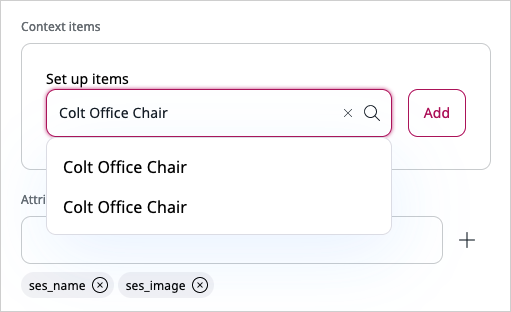

# Preview scenario results

If your [user Role](../permission_management/permissions_and_users.md) has 
the `Personalization/View` permission that includes your website, you can see what 
Content items/products are recommended to the end user when specific [scenarios](scenarios.md) 
are triggered. 
Depending on the scenario type, you might need to provide additional information 
to see the recommendation results.

!!! note "Host multiple websites"

    If you have permissions to access several websites hosted on an [[= product_name =]] 
    instance, you can use the selector field to switch between views for each 
    of these websites.

The number and selection of available scenarios depends on the arrangements that 
your organization makes with Ibexa when defining the initial configuration.

1. Navigate to the **Personalization** > **Scenarios** tab, and then click the **Preview** 
icon next to a scenario that you want to preview.

1. If your scenario is based on models of [popularity type](recommendation_models.md#popularity-models), such as, for example, 
**Landing page** or **Top clicked**, skip to the last step. 

    No further configuration is required.

1. If your scenario is based on models of [collaborative type](recommendation_models.md#collaborative-models), for example, 
**Also clicked**, in the **Context items** area, in the **Set up items** field, and start typing Content item/product name or ID.

    1. From the search results select the respective Content item/product.
    1. Click the **Add** button to confirm.

    

1. If your collaborative scenario has [category-path filtering](filters.md#category-path-filters) 
enabled, for example, **Also clicked - category**, in the **Category path filter** 
area: 
    1. Click **Select path**, and go to the category to be used as a filter, and then click the **Confirm** button.
    1. If stored externally, in the **Path** field manually enter the path to the category, and then click the **Add** button.

1. If your collaborative scenario uses the end user’s history as context, like, for example, 
**Also clicked - user**, enter an end user identifier in the **User id** field, for example, 500.

1. If your scenario has the use of [submodels](recommendation_models.md#submodels) enabled, 
in the **Custom parameters** field, enter the phrase that defines a set of items 
based on a specific attribute, for example "material=wood", and then click the **Add** button.

1. Click **Send request** to display the results.

!!! note "Display response"

    You can preview the exact data object that is returned from the Personalization server 
    and then used by the Personalization service to generate the response. 
    To see the data object, click **See response code**.
