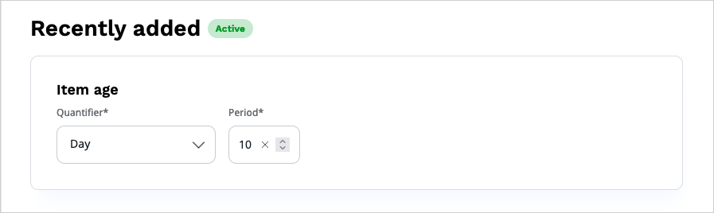
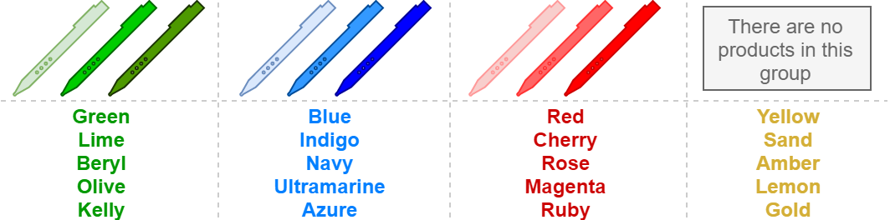

# Recommendation models

Recommendations that are useful in [real-life situations](use_cases.md) are generated by using 
[scenario strategies](scenarios.md) that consist of algorithms (models).
Models are statistics-based and perform calculations based on information about 
[content](content_types.md), users, and [events](event_types.md) in which they're involved.
Calculations run in the background and the results are updated regularly to provide 
the most accurate recommendations. 
Models come predefined with the service, based on the arrangements that your 
organization makes with Ibexa when defining the initial configuration.
You can request that a specific model is created by contacting customer support.

If your [user Role](../permission_management/permissions_and_users.md) includes 
the `Personalization/Edit` Policy, you can modify the models according to your requirements.
To do this, navigate to the **Models** tab and click the **Edit** icon next to a name of the model.

You may have permissions to access several websites hosted on an [[= product_name =]], 
[with independent results returned for each of these websites](use_cases.md#multiple-website-hosting).
If this is the case, use the selector field to switch between views for each of these websites.

## Model types

There are several types of models available, however, the distinction between types isn't visible in the user interface.

### Popularity models

Basic popularity recommendations, such as "Top purchased", "Top consumed" or "Top clicked". 
Models from this category return the most popular content items/products, based on a weighted overall 
usage history (recent events are more important) and category-based filtering (bestsellers 
in the selected category and/or subcategories).

#### Predictive

A predictive popularity model predicts users' purchase behavior and trends, and recommends items based on this behavior.
The model analyzes trends within a configured time period (for example, within a 30-day timeframe), predicts that a new item may have the same trend, and displays the predicted item in recommendations.

### Collaborative models

These models are more complex and require combining data from different sources.

#### Also clicked / purchased

This type of recommendation is often called "Collaborative filtering based on user data" 
and is a proven, powerful approach to calculating recommendations. 
It recommends products that are usually clicked or purchased together. 
It's simple to configure and needs no maintenance.

#### Ultimately bought

This model combines CLICK and BUY events. 
It suggests alternative products, which customers purchased after they clicked 
the selected product. 
It therefore provides a "matching factor" of searching and purchasing. 
In contrast to the "Also purchased" model, it recommends products that are related, 
but not purchased together. 
This model is the best choice to suggest alternative products for their search. 
For example, when a user finds a book and the same book is being recommended on the product page,
it means that other users with the same interest purchased this book (and not others), 
which hints that this book is the best choice.

#### Frequently bought together / Bundle recommendations

Products that were bought in a combination for a certain number of times can be 
recommended as a bundle.
This model can recommend other products that fit the one that the user 
is currently looking at. 

For example, when a user navigates to a product page with a certain smartphone, 
apart from the "Also clicked" recommendations, the Personalization service could 
recommend the *Smartphone + Cover + Headphones* bundle, because they were purchased 
together in exactly this combination several times.

It isn't guaranteed that there is a bundle available for every product. 
Therefore, the rendering logic should display the recommendations if they're available, 
or leave the bundle box out completely. 
The currently displayed product is always part of the bundle.

#### Similar rated

The "Similar rated" model provides recommendations based on user preferences. 
It predicts articles that might suit the user's interests. 
Recommendations for articles similar to their dislikes are suppressed.

#### Best rated

This model provides recommendations based on algorithms that include the ranking 
values and the amount of distinct ratings. 
It's best suited for landing or category pages.

## Editorial and other models

#### Recently added

This model returns a list of items from the recently added items in a configured time period.
For example, if you set item age to 10 days, the model returns items which were added to the database 10 days ago (recently added items). 

It allows injecting new items (products, articles, an so on), to the recommendation while the "History-based" models 
are yet unable to recommend products based on the statistics. 
It's a simplified and unsophisticated alternative if no other information is available 
to calculate and provide recommendations.

This model isn't based on historical records but relies on the imported product catalog.

#### Editor-based

This model returns products from a list that you manually create if you have 
`Personalization/Edit` Policy. 
This way you can replace automatically generated recommendations with ones from a predefined list. 
It's best suited for cases when the store administrator wants to add special offers or sell older stock. 
It could be referred to as "Static recommendations".

#### Blacklist

Items from this list aren't recommended in any scenario.
The model can be configured manually by a user.  
You can use this model to exclude test products or products that are used for system monitoring. 
An element added to this list is never recommended so it must be treated with care, because the blacklist model applies to all scenarios that exist in the system.

#### History-based

Pseudo recommendation model that shows the user products from their own history. 
For example, the "You have just watched" box.

#### Recurring purchase

A recurring purchase model recognizes purchase patterns and returns recommendations for items where these patterns can occur.
This model is based on predictable purchase occurring at regular intervals going forward with a relatively high degree of certainty.
The model recommends items which are suitable for this pattern. Item recommendations are displayed 20% before the completion of estimated time pattern of repeating purchasing the product.

It means, for example, that if the pattern covers 100 days, when the optimal time comes from day 80., the recommendation begins to display. When a user purchases the recommended item on day 92., 
the recommendation is no longer shown and the counter resets.

!!! tip

    Minimum time period for this model is 4 days, but the model works better if you set a longer time period.

### B2B model

This model shows which items were recently clicked or bought for a particular segment group of a company. 
B2B models work for a group of users, not for an individual user, and are considered [segment](configure_models.md#configure-segments) models.

!!! note
    To get recommendations for the specified segment, in the request, pass the parameter only for this segment.
    B2B requests are limited to only one segment ID.

#### Last events B2B models

This model is built on the fly, and requires an access to the most recent events to work.
There are two types of B2B last models:

- B2B last clicked - returns the actual recent items which were clicked by a user with the same `segment ID`. For example, two users from the same `segment ID` can see the last clicked items by anyone from the same `segment ID`.

- B2B last purchased - works the same as last clicked, however, returns actual bought items.
The maximum time from which events can be fetched is 10 days. 

### B2B recurring purchase model

This model is built on the fly. It anticipates and predicts purchase of products that were bought recursively within the same `segment ID`. 
The item appears in this model for recommendation only when it was purchased at least twice by users from the same `segment ID`
in the configured timeframe.

B2B recurring purchase models predict the date of the next purchase based on an average demand per day, extrapolated from BUY events.
The higher relevance of the item, the closer predicted date of the next purchase is. 
The item starts to appear when the time interval is covered in 80% between the date of the last purchased and predicted date of the next purchase. 

For example, if the time interval is set to 10 days and the next purchase is predicted after these 10 days, recommendations are displayed two days before that date.
    
## Submodels

Statistics-based recommendations often have the disadvantage of providing recommendations limited 
to the most popular, most suitable to the user, or most similar products. 
You might want to extend the set of available recommendations by defining a subset of 
items based on external criteria. 

Submodels give you the option to group products based on an attribute. 
Recommendations can then be requested specifically for the selected group.
For example:

- "Also bought clothing with similar colors"
- "Most popular toys for the predefined age"
- "Also bought presents with a predefined price"

Submodels must be manually configured. 
You do this in the property dialog of the recommendation model.
After you configure the submodel, the results are generated overnight and are available 
on the next day.

Once configured, submodels are enabled for the model globally. 
All the scenarios which use this model also use the submodel. 
If you don't want to group recommendations based on a certain attribute, remove the attribute parameter from the request. 
The submodel is then omitted.

!!! note "Multiple submodels in recommendations"

    You can combine recommendations from two different submodels, regardless of their type, within a single recommendation call.
    A response to such call contains only recommendations that come from both submodels at the same time.
    For more information, see [Customizing the recommendation request]([[= developer_doc =]]/personalization/api_reference/recommendation_api/#submodel-parameters) in the developer documentation.

### Nominal attributes

A nominal attribute-based submodel works when the number of values of an attribute 
is relatively small and there is a large group of products for every value.
A good example would be clothes colors in a clothing store, while authors in a book 
store would make a bad example (there are too many of them).

When configuring submodels for a clothing store, you might want to get recommendations 
for a specific color, either predefined or a color of the context item. 
Similar colors can be grouped together, as shown below:

The following results are possible for the products shown in the diagram:

|Attribute from the recommendation request|Result|
|---|---|
|color=lime|Value "lime" is found in the first group. There are products in this group. If a model has any of them, they're recommended.|
|color=sand|Value "sand" is found in the fourth group. There are no products in the group, therefore nothing is recommended by this model. The fallback model could be used if configured.|
|color=white|Value "white" can't be found in any of groups. The main model is used. Items from all submodel groups can appear in the result (as if the submodels weren't configured at all).|
|no attribute specified|The main model is used. The request is handled as if submodels weren't configured at all. Products from the whole store could appear in the recommendation list.|

### Numeric attributes

In numeric attribute-based submodels you define subgroups by setting `from` 
and `to` limits for every group.

The logic used for resolving a submodel is as follows:

- The `from` value indicates the beginning of the range and is included in the subgroup.
- The `to` value indicates the end of the range end and is excluded from the subgroup.
  The only exception is the last of the ranges, where the `to` value is also included. 

!!! note

    You can specify a single or multiple attributes with multiple values 
    for requesting recommendations. 
    Recommendation are fetched from all the submodels and merged based on the weight (relevance). 
    If one of the submodels delivers recommendations with better relevance, 
    the results of other models can disappear from the list.

### Time-slot based models

Time-slot based models consider only a particular range of time rather than the full day when calculating recommendations.
They can be used for [popularity](recommendation_models#popularity-models) and [collaborative](recommendation_models#collaborative-models) types of models.
With time-slot based models, you can request to configure and set specific time slots.

In these models, recommendations are created for both configured time slots and for the main model (for example, for the last 30 days).
However, time-slot based recommendations are shown as priority in the hours for which time slots are configured (if requested in a recommendation call).

These time slots:

- can cover any time frame, including minutes (for example, 11 a.m. - 3:30 p.m), and don't necessarily have to start and end at full hour
- cannot overlap, for example, you cannot set up 8 a.m - 11 a.m and 9 a.m - 12 a.m slots at once
- cannot span between two days, for example, you cannot set slot 11 p.m - 3 a.m

To use time slot-based models, this feature must be enabled.

!!! note "Enable time slots"

    Time slots must be enabled by and configured Ibexa Team.
    To start using this functionality and request that a specific model is created, contact customer support.