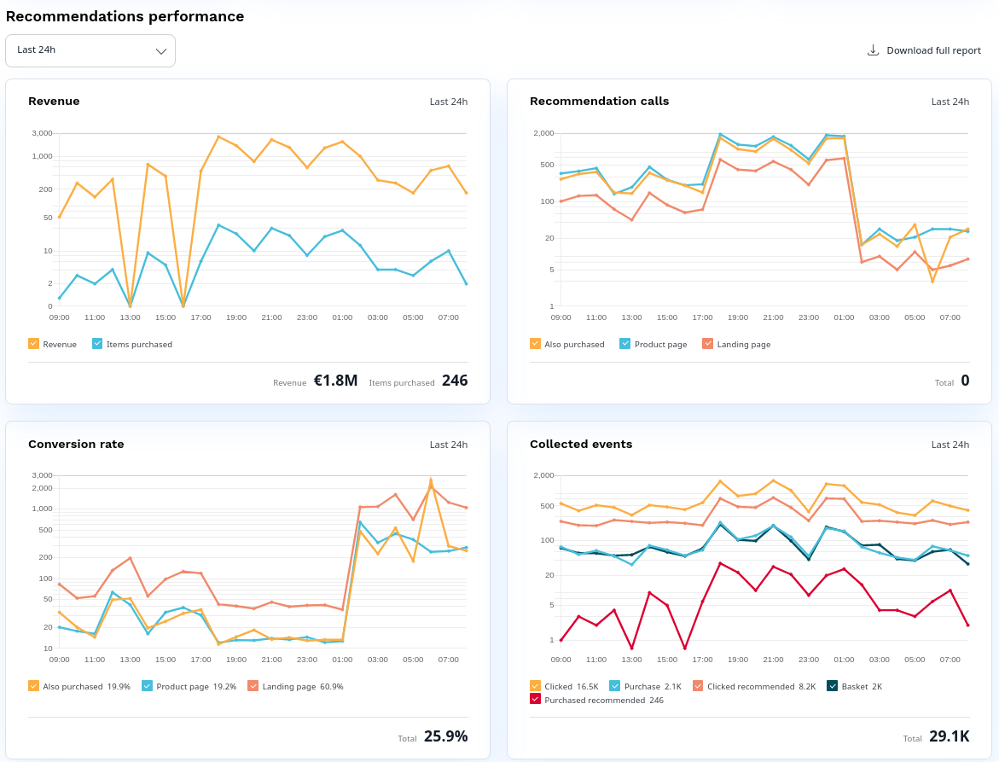

# Review performance

You can review statistical information related to the functioning of the Personalization service, 
to help you fine-tune [models](recommendation_models.md) and [scenarios](scenarios.md) and, 
in consequence, achieve better financial results.
You can do this by visiting the dashboard, where you can monitor the performance 
of the Personalization service.

The dashboard consists of several sections:

- The top section with tiles displaying the most important metrics: number of recommendation calls, number of clicked recommendations, imported items and collected events.
- The diagrams section presents statistical information on how the Personalization service is used and how successful recommendations are, depending on key performance indicators.
- The bottom section with tables presenting detailed information, such as the most popular clicked items and product purchased from recommendations.

!!! note "Host multiple websites"

    If you have [permissions](../permission_management/permissions_and_users.md) to access several websites hosted on an [[= product_name =]] 
    instance, you can use the selector field to switch between dashboards for 
    each of these websites.

## Statistical information

The diagram part consists of four main blocks:

- Revenue:
    The effectiveness of clicked recommendations in terms of revenue or the number of purchases.
- Recommendation calls:
    The number of recommendation calls (total and per scenario).
- Conversion rate:
    The absolute number of converted or sold recommendations.
- Collected events:
    Input data CLICK, BUY, and other events that the Personalization service collects from the website. 
    For more information, see [Events](event_types.md).

In the upper left corner, you can specify the timeframe that you want to analyze.

If you want to analyze metrics further, you can download the statistical information in an XLS format.
To export data, click the **Download full report** button.

Revenue-through-recommendations is an additional monetary value that resulted from 
the clicked recommendations. 
It is calculated by summing up the revenue coming from products that users have purchased 
within 30 minutes from clicking a recommendation.

Recommendation calls - loads recommendations, best categories for a user, reco call is send to Personalization engine.
One call per scenario, each call can serve up to 50 items.

Purchased recommendations is the number of products sold, without any 
revenue/price information.

Conversion (or click-through) - this statistic delivers reliable information if event tracking is implemented correctly. Conversion rate - an indicator which shows the recommendation effectiveness. The number of reco calls divided by the total number of clicked recommendations. This statistic delivers reliable information if event tracking is implemented correctly.

## How statistics are calculated

User's flow
User clicks a product which is not recommended, the click is not included in the statistics.
Additional value from recommendation engine, to show recommendation block, a reco call is sent.
When user clicks recommendation (recommended item), two events are sent: 

- user's click
- user clicked recommended item.

If user adds clicked recommended item to cart and buys it within 60 minutes, this item goes to purchased recommended statistics section. If item was worth 10 euro, the statistic increases both by 1 and 10 euro.

Products purchased is only for commerce account types.