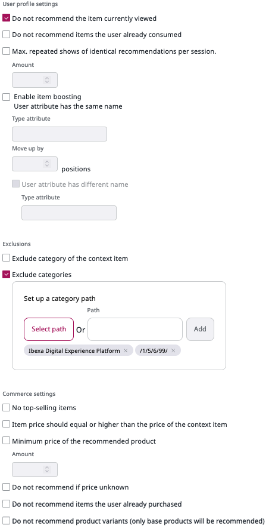

# Scenarios

A scenario is a configuration that is used to obtain recommendation results. 
It consists of:

- A content type to be returned as recommendation 
- A strategy (set of models) that is used for generating recommendations
- A filter configuration

If your [user Role](../site_organization/organizing_the_site.md#permissions) includes 
the `Personalization/View` Policy, you can view the list of scenarios and preview their result.

To modify the scenarios to suit your needs, you must have the `Personalization/Edit` Policy.
You can then navigate to the **Scenarios** tab and click the **Edit** icon next to 
the name of the scenario.

## Content type configuration

Every scenario supports a single input type and multiple output types. 
Every recommendation request delivers only content of one output content type 
(even if multiple types are selected in the interface below). 
The output type is set during the recommendation request and must be covered by 
the list of the supported content types in the requested scenario.

## Strategy configuration

To modify the strategy, you drag model boxes between a list of all available models and the scenario 
board on the right side.
To avoid empty or insufficient recommendation results, add several models to every strategy.

You can arrange models within a scenario board by importance.
Models from each level are used in parallel and strategy results contain an equally 
distributed mixture of both model results. 
If models from one level do not return enough results, models from the 
subsequent levels are used.

If your models support additional differentiators, you can apply them here:
pick a context from a drop-down with a list of available context options,
and/or select the **Use submodels** checkbox to group all products based on a selected attribute.
For more information, see [Advanced model configuration](recommendation_models.md#advanced-model-configuration). 

The configuration performed in this step is applied only to the selected scenario.

## Filter configuration

For every recommendation scenario a set of general filters can be defined that 
are applied to all recommendations from every model used in the scenario.

For more information, see [General filters](filters.md#general-filters).

For each of the categories from the strategy configuration matrix, you can click 
the **Configure** icon and configure category filters. 
For a detailed description, see [Category Filter](filters.md#category-filter).

## Next steps

When you have configured the personalization service, you can 
[preview scenario results](previewing_scenario.md) and 
[embed them in your website](integrating_results.md).
