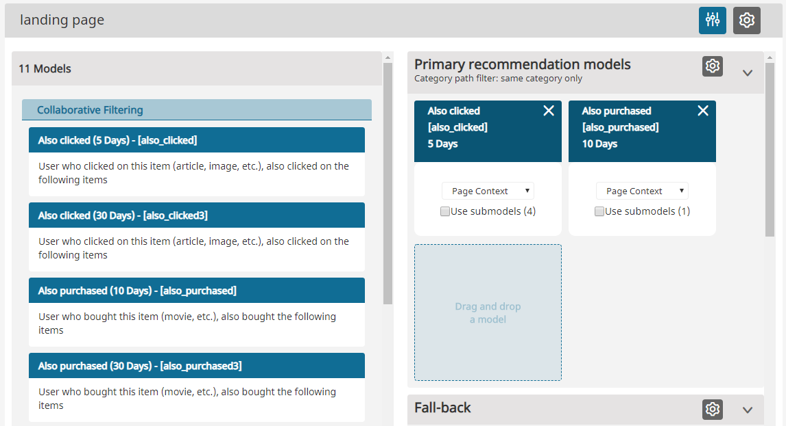
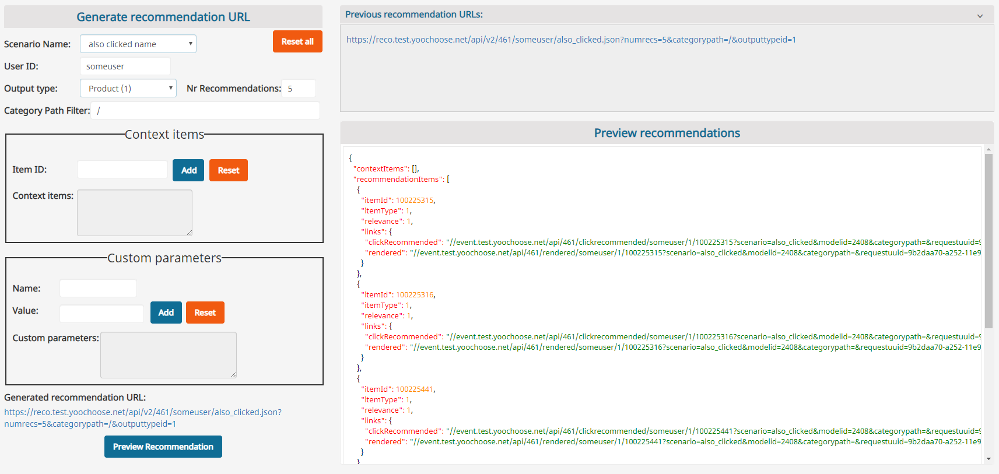

# 8. Scenarios

A scenario is a configuration for getting recommendations. It consists of:

1. a content type to be returned as recommendation, 
1. a filter configuration,
1. a set of models to be used for generating recommendations.

We strongly encourage adding several models to a scenario in order to avoid empty recommendation boxes. In the configuration interface there is a matrix provided for the configuration. You can drag available models from the left side into the scenario matrix on the right side.

The scenario configuration field has several rows. Models located in the same row will be used in parallel and the result will contain an equally distributed mixture of all used model results (horizontal configuration). Models located on the second and third row will be used only if models from the row above return no or not enough results (vertical configuration).

Following the example in the images, the first recommendations that will be displayed to the user will come from "Also purchased". If there are no or not enough recommendations available, the "Also clicked" model will be requested. If there are still not enough products in the result set, the "Top purchased" products from the Fail-safe row (not visible in the example image) will be added according to the number of requested recommendations. On the right side of the first rows there is a button to configure Category Filter usage in the recommendation request. This is described in detail in [Category Filter](filters.md#category-filter).

In contrast to the model configuration described in the chapter [6. Recommendation Models](recommendation_models.md), the configuration performed in this step is applied only to the selected scenario.

The **Preview** tab can be used to simulate a recommendations request performed by the system. One only needs to add the required parameters and click 'Send' (in the upper right corner).

