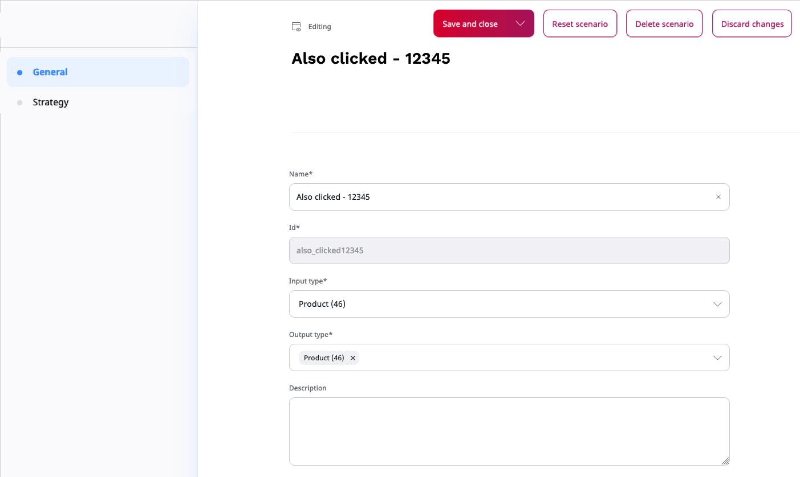

# Scenarios

A scenario is a configuration that is used to obtain recommendation results. 
It consists of:

- A Content Type to be returned as recommendation 
- A strategy (set of models) that is used for generating recommendations
- A filter configuration

If your [user role](../site_organization/organizing_the_site.md#permissions) includes 
the `Personalization/View` Policy, you can view the list of scenarios and preview their result.

To modify the scenarios to suit your needs, you must have the `Personalization/Edit` Policy.
You can then navigate to the **Scenarios** tab and click the **Edit** icon next to 
the name of the scenario.

You may have permissions to access several websites hosted on an [[= product_name =]], 
[with independent results returned for each of these websites](use_cases.md#multiple-website-hosting).
If this is the case, use the selector field to switch between views for each of these sites.

## Content type configuration

Every scenario supports a single input type and multiple output types. 
Every recommendation request delivers only content of one output content type 
(even if multiple types are selected in the interface below). 
The output type is set during the recommendation request and must be covered by 
the list of the supported content types in the requested scenario.

## Strategy configuration

To modify the strategy, you drag model boxes between a list of all available models and the scenario 
board on the right side.
To avoid empty or insufficient recommendation results, add several models to every strategy.

You can arrange models within a scenario board by importance.
Models from each level are used in parallel and strategy results contain an equally 
distributed mixture of both model results. 
If models from one level do not return enough results, models from the 
subsequent levels are used.

If your models support additional differentiators, you can apply them. By default, a model does not use submodels or segments.
To group items based on supported data types for the model, from the **Data type** and **Context** drop-downs, select the required options.
You can choose between **Submodels** or **Segments** data types.
For more information, see [Advanced model configuration](recommendation_models.md#advanced-model-configuration). 

The configuration performed in this step is applied only to the selected scenario.

## Filter configuration

You can define a set general filters for every recommendation scenario.
Filters are applied to all recommendations that come from models selected in the strategy.

For more information, see [General filters](filters.md#general-filters).

If you want to configure category filters for each of the categories from the strategy configuration matrix,
click the **Configure** icon and make necessary changes.

For a detailed description, see [Category path filters](filters.md#category-path-filters).

## Next steps

When you have configured the Personalization service, you can 
[preview scenario results](previewing_scenario.md) and 
[embed them in your website](integrating_results.md).
