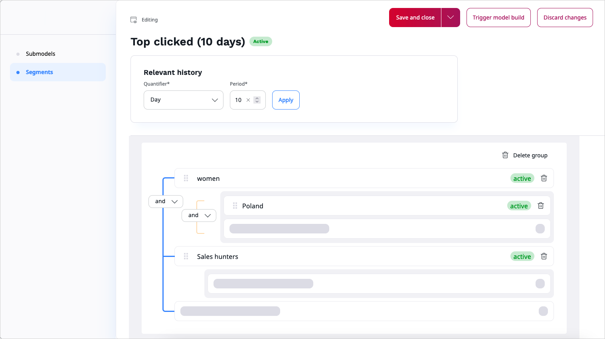

# Segment management

Segments allow getting personalized content suitable for particular user groups. They compute models based on segment attribute factor.
Information with user segment is provided in each event which comes from the tracking script.

## Configure segments

With segment groups you can assign users to different recommendation groups based on data gathered and deliver recommendations to these user groups.

The **Segment** list displays only active segments and is generated from the events collected for relevant history (the actual data from recommendation engine, not what is added using the Back Office).

The value of each segment is transfered to the event.

Models are displayed only for a selected time period. 
If a group is inactive for a certain period of time, the segments get `Inactive` status and cannot be used.


### Operators and segmentation logic

Segmentation logic in segment groups allows you to divide target audience according into their specific traits, for example, demographic, 
behaviors, age, to provide narrowed, and better tailored recommendations.
You can build complex segment groups using parent and nested (child) segments connected with operators which enable precise filtering.

With operators you can establish filtering rules for recommendations based on segments, and create nested groups within parent groups.

!!! tip

    You can add unlimited number of children in the parent group.

**AND** - use when you want to intersect two or more values for a particular segment. All set conditions must be met.

**OR** - use when you want to broaden results; one of the conditions must be fullfiled.

Nested (child) segments can have different conditions than their parent. However, the relation between parent and child is always `AND`.
Use them to create sub segment groups which narrow filtering of recommendations to specific traits of your users.

Segments available in the **Elements** sections are reusable. It means, you can use the same segment in different segment groups.


### Create segment group with AND logic condition


The following example shows segment groups with `AND` operators linking nested elements:

- women
- Poland 
- sales hunters (as a type of customers.)





All three criteria are linked with `AND`operator so, all conditions must be fullfiled. 

Recommendation call in scenario using model with segments, contains requests to all specified segments with `AND` conditions:

`https://reco.test.perso.ibexa.co/api/v2/41307/588/landing_page?numrecs=6&attribute=ses_name,title,ses_image,teaser_image&crosscontenttype=1&segments=7,11,14`

Where segments ID correspond to segment groups:

- women - `segment ID=7`
- Poland - `segment ID=11`
- sales hunters - `segment ID=14`

As a result, a reco call returns two events which qualify for these segment groups requirements.
Two items with `ID=587` and `ID=588` relevant for the following segment combinations, clicked by:

- for womem from Poland

and

- for sales hunters.

```json hl_lines="5 28"
    {
   "contextItems": [],
   recommendationItems: [
      {
         itemId: 587,
         itemType: 57,
         relevance: 1,
         links: {
            clickRecommended: "//event.test.perso.ibexa.co/api/41307/clickrecommended/someuser/57/587?scenario=landing_page&modelid=10316421&categorypath=&requestuuid=276a5930-dea3-11ed-8cdf-92a64ae30943",
            rendered: "//event.test.perso.ibexa.co/api/41307/rendered/someuser/57/587?scenario=landing_page&modelid=10316421&categorypath=&requestuuid=276a5930-dea3-11ed-8cdf-92a64ae30943"
         },
         attributes: [
            {
               key: "title",
               values: [
                  "Woods edge living room"
               ]
            },
            {
               key: "teaser_image",
               values: [
                  "/var/site/storage/images/4/5/7/0/754-1-eng-GB/245d16d84164-living-room3.jpg"
               ]
            }
         ]
      },
      {
         itemId: 588,
         itemType: 57,
         relevance: 1,
         links: {
            clickRecommended: "//event.test.perso.ibexa.co/api/41307/clickrecommended/someuser/57/588?scenario=landing_page&modelid=10316421&categorypath=&requestuuid=276a5930-dea3-11ed-8cdf-92a64ae30943",
            rendered: "//event.test.perso.ibexa.co/api/41307/rendered/someuser/57/588?scenario=landing_page&modelid=10316421&categorypath=&requestuuid=276a5930-dea3-11ed-8cdf-92a64ae30943"
         },
         attributes: [
            {
               key: "title",
               values: [
                  "Minimalist luxury in a small and stylish bedroom"
               ]
            },
            {
               key: "teaser_image",
               values: [
                  "/var/site/storage/images/0/0/7/0/700-1-eng-GB/de8a98767362-bedroom2.jpg"
               ]
            }
         ]
      }
   ]
}
```

### Create segment group with OR logic condition

The following example shows segment groups with `OR` operator connecting nested elements:

- women
- Poland
- 25-35 (age)
- Germany


In these case to get recommendations, only one condition must be met: women from Poland or women from Germany.

`https://reco.test.perso.ibexa.co/api/v2/41307/someuser/landing_page?numrecs=6&attribute=ses_name,title,ses_image,teaser_image&crosscontenttype=1&segments=7,8,10,11`

Where segments ID correspond to segment groups:

- women - `segment ID=7`
- Poland - `segment ID=11`
- 25-35 - `segment ID=8`
- Germany - `segment ID=10`

As a result, a reco call returns only one event which qualify for these segment group requirements. The item with `ID=587` relevant for this segment combinations, clicked by:

- women from Poland at age 25-35 

or 

- by women from Germany at age 25-35

```json hl_lines="5"
   {
   "contextItems": [],
   recommendationItems: [
      {
         itemId: 587,
         itemType: 57,
         relevance: 1,
         links: {
            clickRecommended: "//event.test.perso.ibexa.co/api/41307/clickrecommended/someuser/57/587?scenario=landing_page&modelid=10316421&categorypath=&requestuuid=7ff8c8b0-e282-11ed-9a93-aefcc75529b6",
            rendered: "//event.test.perso.ibexa.co/api/41307/rendered/someuser/57/587?scenario=landing_page&modelid=10316421&categorypath=&requestuuid=7ff8c8b0-e282-11ed-9a93-aefcc75529b6"
         },
         attributes: [
            {
               key: "ses_name",
               "values": []
            },
            {
               key: "title",
               values: [
                  "Woods edge living room"
               ]
            },
            {
               key: "ses_image",
               "values": []
            },
            {
               key: "teaser_image",
               values: [
                  "/var/site/storage/images/4/5/7/0/754-1-eng-GB/245d16d84164-living-room3.jpg"
               ]
            }
         ]
      }
   ]
}
```