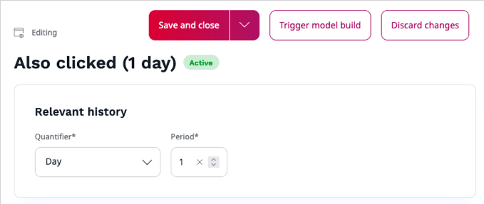

# Segment management

Segments allow getting personalized content suitable for particular user groups. They compute models based on segment attribute factor.
Information with user segment is provided in each event which comes from the tracking script.

## Configure segments

If your [user Role](../permission_management/permissions_and_users.md) includes 
the `Segment/All functions`, `Segment group/All functions` Policies, you can configure segment settings in the models according to your requirements.
To do this, go to **Personalization** > **Models**, and click the **Edit** icon next to a name of the model.

With segment groups you can assign users to different recommendation groups based on data gathered and deliver recommendations to these user groups.

The **Segment** list displays only active segments and is generated from the events collected for relevant history (the actual data from recommendation engine, not what is added using the Back Office).

The value of each segment is transfered to the event.

Models are displayed only for a selected time period. 
If a group is inactive for a certain period of time, the segments get `Inactive` status and cannot be used.

### Operators

For example, if you want to 

AND - narrows the criteria of a user segment, 

OR