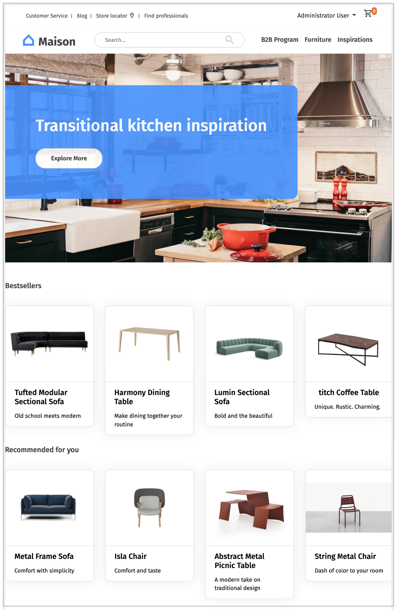
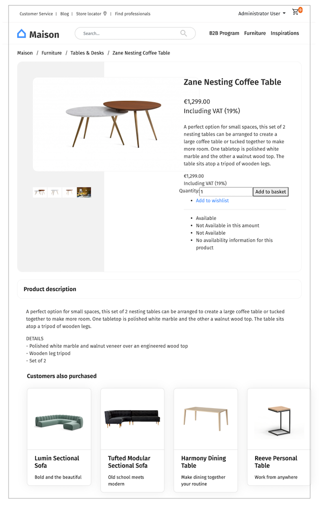
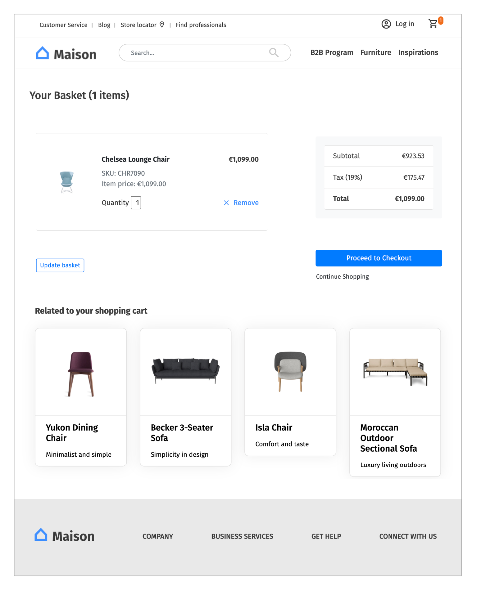

# Use Cases

There are many different cases where you can use recommendations. 
The most common ones can be found in the e-commerce and publishing industries.

## E-commerce

E-commerce recommendations can prove very useful in helping customers find what they're looking for. 
When a user is not sure about what to buy, recommendations can suggest similar, alternative 
or complementary products. 
Some typical use cases are:

- On the landing page the current bestsellers ('Hot Sellers') are shown to every customer.
- A detail page displays the products that were bought by others ('What other customers bought') 
  or have been frequently bought together (e.g. this TV and a HDMI cable).
- The shopping cart page shows recommendations ('Related to your shopping cart') matching the 
  products in the cart.
- On a category page, bestsellers of the current category are shown.
- Additionally on the landing page and on the detail page a recommendation bar could be placed 
  to show **personalized recommendation** (based on their latest profile information) for the current user.

In the pictures above, each recommendation box represents a scenario. 
Scenarios are configurations that define what kind of recommendations should be delivered. 
For more information, see [Scenarios](scenarios.md).

## Publishing

In the publishing business, recommendations bring indirect value by keeping users on the website. 
Unlike in the e-commerce business, publishers often do not sell content, it is provided for free 
and cross-financed by advertisement. 
Increasing the CTR (click-through-rate) and adding value generated by advertisement is one of 
the drivers in the publishing business. 
Use cases for placing recommendations are straightforward:

- On the landing page, the most read content is presented.
- On every category page, the most popular content in the current category is shown.
- On every content page, the related content is shown.
