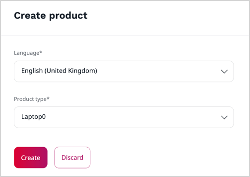

# Create and edit products

[Products](products.md#products) are a specific kind of [content items](../content_management/content_items.md#content-items) that you use to present your offer in the website, including product specification, and pricing.
Individual products are instances of [product types](create_product_types.md#create-product-types).
You can only create or modify products when your [user role](../permission_management/work_with_permissions.md) has the `Product/Edit` permission.

To create a product, depending on how the product type is defined, you [may need to provide](products.md#product-completeness) certain pieces of information in their respective [fields](../content_management/content_model.md#fields-and-field-types).

You can create products using either manual or bulk method.
Bulk method can be used only at the developer level.
See [Products]([[= developer_doc =]]/pim/product_api/#products) for a technical guide on how to do this.

1\. Click **Product catalog** -> **Products**.

2\. If you're adding a new product, click **Create** and skip to step 4.

3\. If you're editing an existing product, in the **Category filter** tree, select a category to find your product more quickly.
Then click the **Edit** button next to a name of the product item that you want to modify and skip to step 5.

4\. From their lists, select the language and the product type, and then click the **Add** button.

5\. Fill in or edit content fields of the product, for example, name, specification and description.
Fields marked with an asterisk (*) are required.

6\. In the Attributes section, define the product's attributes, for example, dimensions, resolution or capacity.

7\. If you're adding a new product, click the **Create** button.
If you're editing an existing one, click the **Update** button.

After you create a product, you can [add image assets to a product](work_with_product_assets.md), [create variants to the main product](work_with_product_variants.md), [define product prices](manage_prices.md), [set the available quantity](manage_availability_and_stock.md) and [classify products into different categories](work_with_product_categories.md).

!!! note

    Feature availability may differ depending on the specifics of your installation.

For in-depth information, see [Products]([[= developer_doc =]]/pim/products/) in developer documentation.
