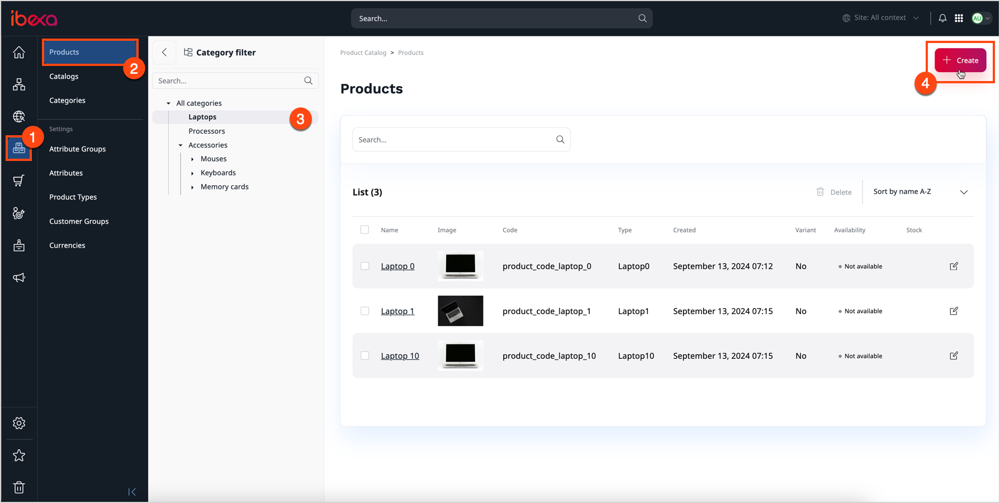

# Create products

[Products](products.md#products) are a specific kind of [Content items](../content_management/content_items.md#content-items) that you use 
to present your offer in the website, including product specification, and pricing.

Individual products are instances of [product types](create_product_types.md#create-product-types).

You can only create or modify products when your [user role](../permission_management/work_with_permissions.md) has the `Product/Edit` permission.

To create a product, depending on the configuration, you [may need to provide](products.md#product-completeness) certain pieces of information, 
such as a name, SKU, description and images, attributes, assets, availability, prices, and translations.

You can create product by using manual or bulk method.
Bulk method can be used only at the developer level. See [Products](https://doc.ibexa.co/en/latest/pim/product_api/#products) for a technical guide on how to do this.

## Manually create product

You can create product in several ways:

1. Click **Create** in the upper-right corner of the [Products](products.md) screen. 
2. While viewing a **Product Catalog** in the [Content Tree](../getting_started/discover_ui.md#content-tree), click **Create content** at the top of the screen.
The new item appears in the tree.
3. Click **Create content** in the upper-right corner of the [My dashboard](../getting_started/discover_ui.md) screen. In this case you have to choose Content Type and select where the content will be located.

1\. If you are adding a new product, use one of the methods mentioned above and  and skip to step 3.

2\. If you are editing an existing product, click the **Edit** button next to a name of the product item that you want to modify and skip to step 4.

2\. From their lists, select the language and the product type, and then click the **Add** button.

3\. Fill in or edit content fields of the product, for example, name, specification and description.
The [Fields](../content_management/content_model.md#fields-and-field-types) that you have to populate depend on how the Product Type is defined. 
Fields marked with an asterisk (*) are required.

4\. In the Attributes section, define the product's attributes, for example dimensions, resolution or capacity. Attributes depend on defined Product Type
and some of them can be required.

5\. If you are adding new product, click **Create** button.
If you are editing existing one, click **Update** button.

## Work with products

You can also [add image assets](work_with_product_assets.md) to the products, [create variants to the main product](work_with_product_variants.md), [define prices](manage_prices_and_stock.md) and [clasify products into different categories](work_with_product_categories.md).

Be aware that some functinalities may differ depending on the specifics of the installation.

For more information, see [Products](https://doc.ibexa.co/en/latest/pim/products/).