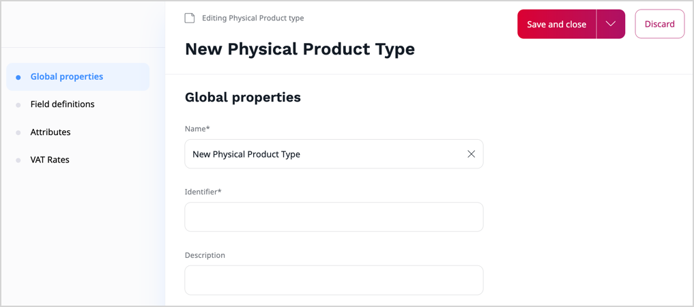

# Create Product Types

If your [user Role](../permission_management/work_with_permissions.md) has the `ProductType/Edit` permission, you can modify Product Types and add individual attributes or attribute groups.

1\. In the left panel, go to **Product catalog** -> **Product Types** and click **Create**.

2\. From the drop-down list choose `Physical` or `Virtual` type and click **Add**.

3\. Fill in basic product information: name, identifier and description.

Each product has a product code that must be unique. It identifies the product in the system.
Product code can have up to 64 characters. It can contain only letters, numbers, underscores, and dashes.

4\. Add Fields that describe the product by dragging them from the **Field types** 
area to a section on the left, and then [configure them](../content_management/configure_ct_field_settings.md).

5\. Add attributes by dragging them from the toolbox on the right.

## Work with product attributes

When adding attributes to Product Types, you can add both individual attributes, 
and whole groups. 
You can also remove while groups, or single attributes from groups that you do not 
want to use for the given Product Type. Do this by clicking the trash icon next 
to the group or attribute.

You can also remove whole groups, or single attributes from groups that you do not 
want to use for the given Product Type.
Do this by clicking the trash icon next to the group or attribute.

For every attribute, you can select **Used for product variants**.
Attributes that have this option are used to [automatically generate product variants](work_with_product_variants.md#generate-variants).
