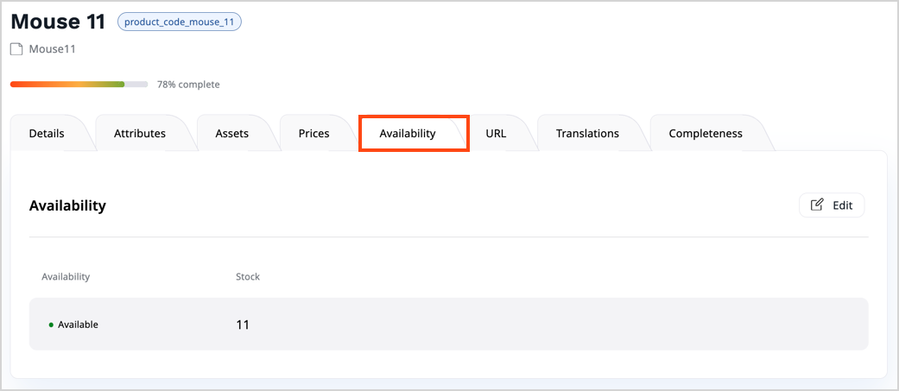
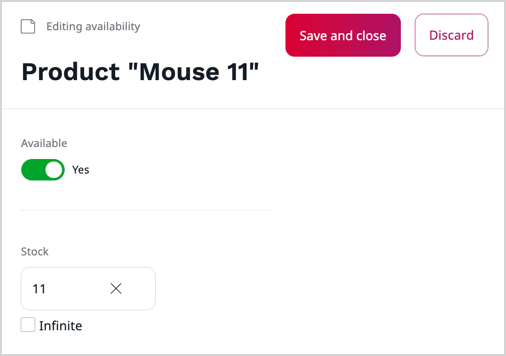

# Work with availability and stock

In case of [products](products.md), being available translates into being offered for purchase.

You can control a product's availability, and the available stock.
You can either set the exact number of product pieces available in stock or indicate that availability is infinite, for example, for digital, downloadable products.

## Set product availability

To control a product's availability and the available stock, in product or variant view go to **Availability** tab.
If a product can have variants, you must set availability for each variant separately.

In the **Availability** tab, click **Create** to add availability to a product that doesn't have it,
or **Edit** to modify existing availability settings.

Use the **Available** switcher to indicate whether the product is currently available in the catalog.

You can also set the exact number of products available in stock.
Set the availability to **Infinite** if specific stock number is not tracked.
You can use it, for example, for digital, downloadable products.

