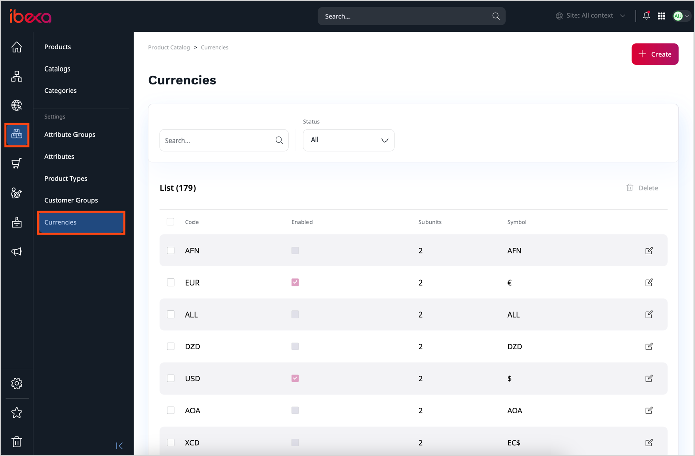
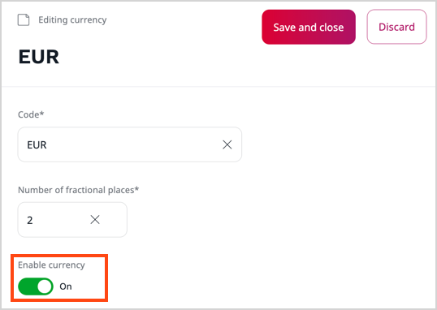

# Work with currencies

Currencies are taken into account when calculating product price.

You can configure currencies available in the system.
To do it, in the left panel, go to **Product catalog** -> **Currencies**.

The system contains a list of different currencies.
To use them in the catalog, edit and enable them.

To create an additional currency, provide its code (for example, EUR, USD, or GBP) and the number of fractional digits, that is, the number of digits after the comma/period.

For example, the configuration for the Swiss franc would be `CHF` with two fractional digits.
