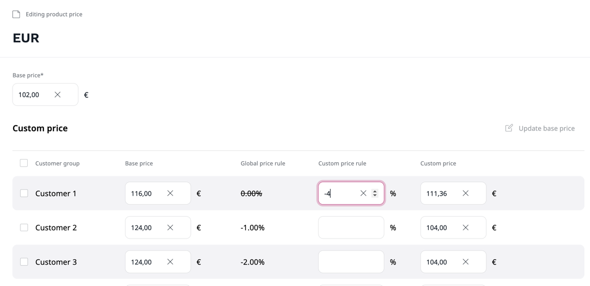

# Work with product prices

[Products](products.md) and product [variants](work_with_product_variants.md) can have a base price and multiple custom prices.
Prices can differ depending on [customer group](../customer_management/manage_customers.md) and [currency](../pim/manage_currencies.md) and be applied according to the rules.

With price management features, you set up product prices manually.

!!! note

    To set up product prices, your system must have at least one currency enabled.

To set a price, navigate to the product's or product variant's **Prices** tab.
Here you can see the existing prices for the selected [currency](../pim/manage_currencies.md).

Select a currency in the dropdown menu to preview the price and click the **Edit** button to modify it.

For each product or product variant you can set different prices for different customer groups.
Next to the base price you can see the **Global Price rule** defined for this customer group, which is applied to the base price.
However, you can also set a **Custom price rule** for this product.
If you define it, the global price rule don't apply and the custom price rule is applied directly to the base price.

You can preview the resulting price for this product and the given customer group in the **Custom price** field.

