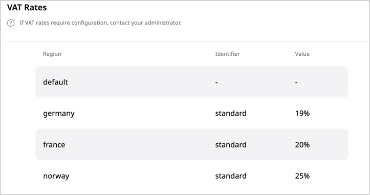

# Product types

Product types are templates that contain a combination of [fields](../content_management/content_model.md#fields-and-field-types) and [attributes](#attributes) which constitute a product definition.
By default, product types contain such fields as name, specification, image, or category.
You can modify them as required.
You need different product types, because products of type "Laptops" contain different fields and attributes than those of type "White appliances".

When you create a new product type, you can choose between two available product type flavors: Physical and Virtual:

- Physical - tangible products.
They can use measurement attributes. They require shipment in the online purchase process.
Examples: heaters, laptops, phones.
- Virtual - non-tangible items. They can be sold individually, or as part of a product bundle.
They don't require shipment in the online process. Examples: memberships, services, warranties.

A product type also defines both the attributes and VAT rates for all its products.

When a product type is created, you can review its fields, attributes, and VAT rate settings on the product type's details screen, without having to open it for editing.

If your [user role](../permission_management/work_with_permissions.md) has the `ProductType/Edit` 
permission, you can [modify product types and add individual attributes or attribute groups](create_product_types.md).

### Attributes

Unlike text fields that can be formatted and are intended to be displayed, product attributes precisely list product properties or specifications.

Attributes serve as criteria for filtering and searching for products.
They can also be used to define product variants.
Attribute types define what kind of information you can store in an attribute.
Typical product attribute examples include dimensions, weight, color, or format.

For more information, see [Work with product attributes](work_with_product_attributes.md).