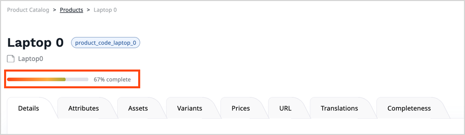
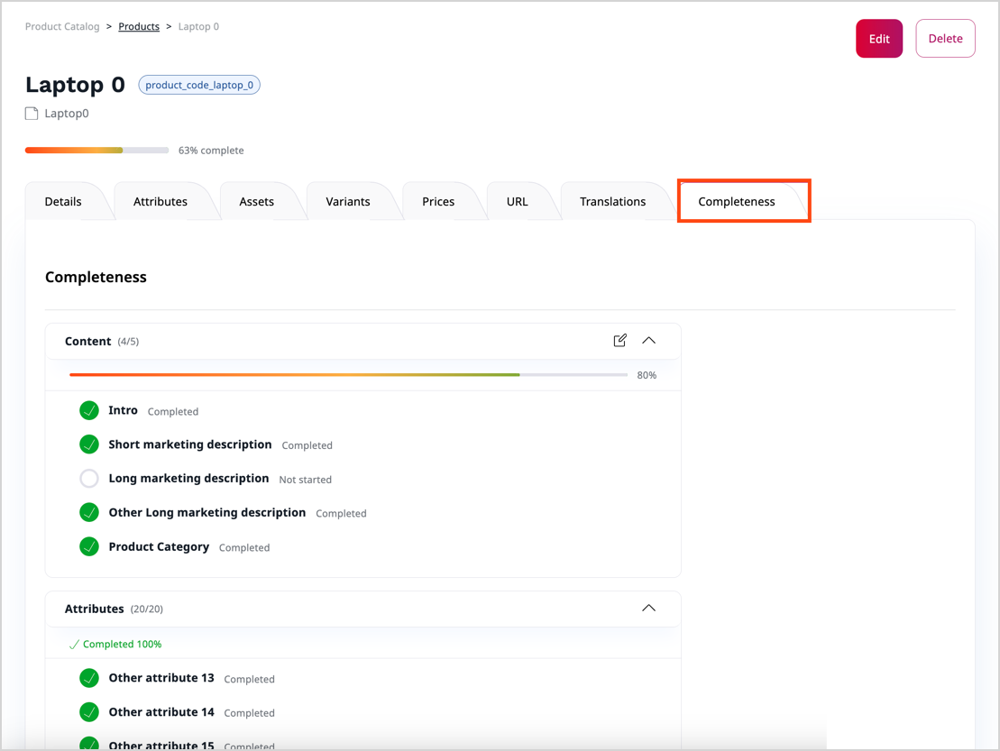

# Products

Products are instances of a particular [product type](product_types.md).
A product is an object that's based on a product type template.
It can have [variants](work_with_product_variants.md) that you build around [attributes](work_with_product_attributes.md).
Products can be put in [catalogs](work_with_catalogs.md) and organized into [categories](work_with_product_categories.md).

For each product and product variant, you can define its [availability](manage_availability_and_stock.md), stock and [prices](manage_prices.md).

When you create or edit products, you can add [assets](work_with_product_assets.md) in a form of images.
Assets can be assigned to the base product, and to one or more of its variants.

For more information about creating products, see [Create product](create_edit_product.md#create-and-edit-products).

### Product completeness

Before your customers can purchase products, the website [administrator must configure]([[= user_doc =]]/pim/enable_purchasing_products/) at least one region and one currency for the shop, and VAT rates for each of the regions.
You must then set:

- VAT rates for the product type
- at least one price for the product
- availability with positive or infinite stock for the product

When you create or edit a product, under the product name, you can see a progress bar with an approximate indication
of how much of the product information you provided, and how much is still missing.

To find out in detail, which pieces of product information require your attention, go to the product view's **Completeness** tab.
It lists all tasks required for product configuration, including:

- content (such as images and descriptions)
- attributes
- assets
- variants (if any of the attributes is enabled for variants)
- availability
- prices in different currencies
- translations

You can click the edit button next to an unfinished task in the Completeness table
to go directly to the screen where you can add the missing information.

