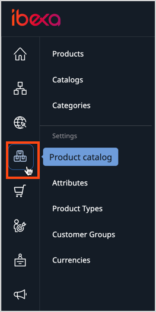

# Products

With **PIM**, [[= product_name =]] handles products offered in the website, 
including their specifications, and pricing.

PIM's features are available from the left menu.

To create a product you must first decide which Product Type it belongs to.

## Product Types

Product Types represent categories that a product can belong to.
They define what combination of Fields is available in the product, and Fields 
can store different types of information.
For example, products of publication type contain different Fields than white 
appliances.

You can choose between two available types: `Physical` and `Virtual`:

- `Physical` - a tangible products with assigned stock. 
They can use measurement attributes. They require shipment in the online purchase process.
Examples: heaters, laptops, phones.
- `Virtual` - a non-tangible items. They can be sold individually, or as part of a product bundle.
They do not require shipment in the online process. Examples: memberships, services, warranties. 

A Product Types also defines the attributes that all products of this type can have.

If your [user Role](../permission_management/work_with_permissions.md) has the `ProductType/Edit` 
permission, you can [modify Product Types and add individual attributes or attribute groups](create_product_types.md).

### Attributes

Attributes describe product characteristics.
Customers can use them to filter and search for products.

Typical product attribute examples could include length, weight, color, or format.

Attribute types define what type of information you can store in an attribute.
Available attribute types are:

- Checkbox
- Color - presented as a hex value
- Float - represents a number with fractions
- Integer - represents a number without fractions (a whole number)
- Measurement (range) - measurement with a given unit and minimum/maximum values selectable per Product Type
- Measurement (single) - measurement with a single value in given unit
- Selection - one of a list of customizable options

Each attribute belongs to an attribute group.
An example of an attribute group can be dimensions (which consists of length, width, height, and so on).

## Products

Products are instances of a particular Product Type.
A product is an object that is based on a Product Type template.
Products can have variants that you build around attributes.
They can be categorized and organized into catalogs.

Also, for each product and product variant, you can define its availability, stock and price.

For more information about creating products, see [Create product](create_edit_product.md#create-and-edit-products).

### Product assets

When you create or edit products, you can add assets in a form of images.
Assets [can be assigned](work_with_product_assets.md) to the base product, and to one or more of its variants.

### Product completeness

When you create or edit a product, under the product name, you can see visual indication
of what part of product information (tasks) you have completed, and what part is still missing.

Here you can see full information about completed tasks in the product view's **Completeness** tab.

This tab lists all tasks required for product configuration, including:

- content (such as images and descriptions)
- attributes
- assets
- availability
- prices in different currencies
- translations

You can click the edit button next to an unfinished task in the Completeness table
to move directly to the screen where you can add the missing information.

## Product categories

With product categories you can organize products within PIM and create relationships between them. 
One of the reasons for applying product categories is assisting users in searching for products.

Each category can be assigned to multiple products, and each product can belong to multiple categories of different or similar character, for example:

- Business Laptops
- Windows OS Devices
- Stock clearance

You can enable the use of product categories, assign products to categories and vice versa, and [define your own categories](work_with_product_categories.md).

## Product variants

Product variants enable you to have multiple versions of one product, differing in some characteristics.

Typical examples are a t-shirt in different colors, or a laptop with different hard disk sizes.

You can [create variants based on product attributes](work_with_product_variants.md).

## Product prices

 You can [set a base price and custom prices](manage_prices.md) for the product and for its variants.
 Prices can differ depending on [customer group](../customer_management/manage_customers.md) and [currency](../pim/manage_currencies.md) and be applied according to rules.

## Product availability and stock

You can [control a product's availability](manage_availability_and_stock.md), which translates into 
whether it is being offered for purchase, and the available stock.
You can either set the exact number of product pieces available in stock or indicate 
that availability is infinite, for example, for digital, downloadable products. 

## Product catalogs

You can [create special catalogs](work_with_catalogs.md), for example, to differentiate the offering 
that is presented to B2B and B2C users, retailers and distributors or different regions.
Catalogs contain a sub-set of products from the system.

