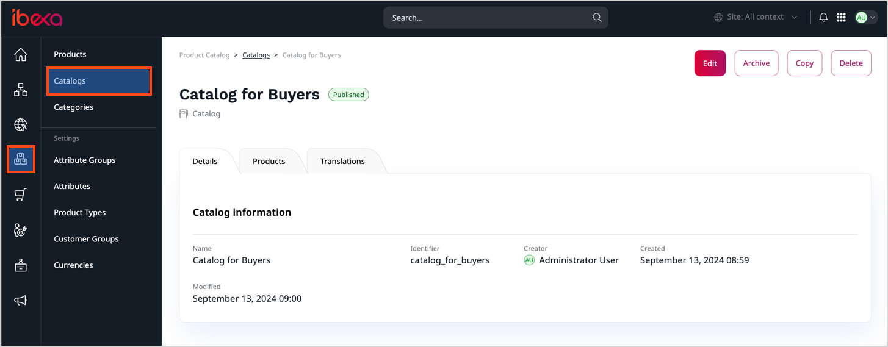
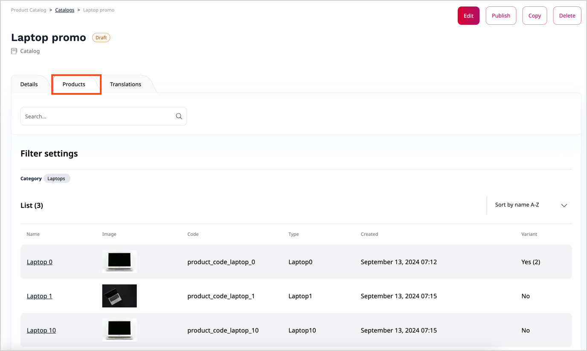

# Work with catalogs

You can create special catalogs, for example, to differentiate the offering 
that's presented to B2B and B2C users, retailers and distributors or different regions.

## Catalogs

Catalogs are collections of [products](products.md) selected by using configurable filters.
They are specific to each of your websites or storefronts, which means that they contain products that are presented or sold in a specific website.

## Create catalogs

To create a catalog:

1. In the left panel, go to **Product catalog** -> **Catalogs** and click **Create**.
2. Enter the name and identifier for the catalog.
3. Select filters that decide which products are included in the catalog.
4. Click **Create**.

After you create a catalog, it is draft mode.
To make the block available, for example, in page blocks, you must publish it.

1. In the **Catalogs** page, click the name of a catalog that you want to publish.
2. On the catalog details page, the upper right corner, click **Publish**.

### Catalog filters

When you create a new catalog, all products are included in it by default.
You can narrow down this selection by applying the following filters from the **Add filter** menu:

- Category
- Created (date when the product was created)
- Availability
- Code
- Price (in selected currency, with the option to set minimum and maximum price)
- Type
- and additionally, filters based on all configured product attributes

The **Products** section at the bottom of the catalog screen shows a preview of which products fit the current filters.
The list is updated automatically when you add or modify filters.
You can also remove selected filters there.

You can view all products in a catalog in its **Products** tab:

## Copy catalogs

You can copy existing catalogs, for example to create a variant version of an offer with slightly differing filters.
To do so, in the catalog's view screen click **Copy**.

You can then modify the copied catalog (for example, change its name or fine-tine filters), and save the updated version.
