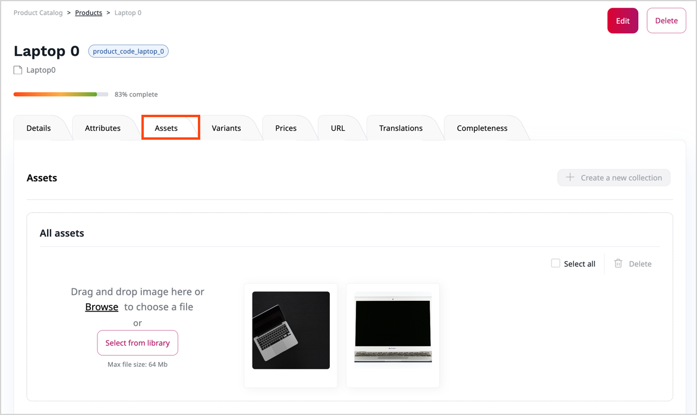
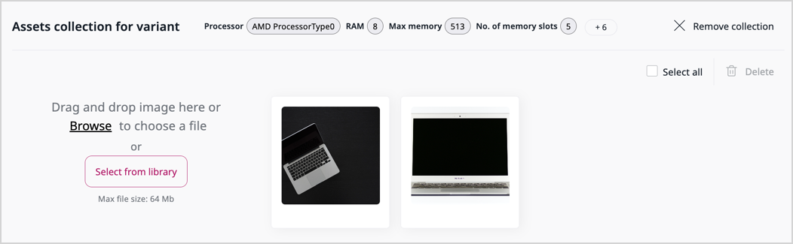
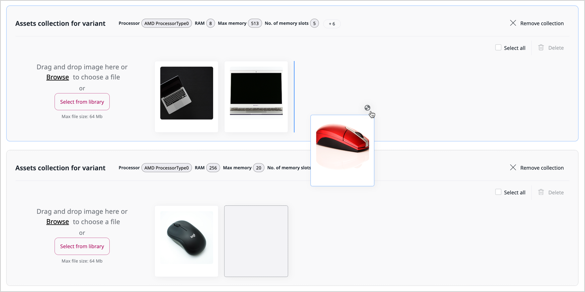

# Work with product assets

You can add image assets to products or product variants.

To add assets to a product, in the product's **Assets** tab browse or drag and 
drop image files from disk, or select an existing image asset from library.

You can assign assets to product variants by placing them in a collection.
A collection corresponds to specific values of attributes and is automatically assigned to the variant or variants
that have these attribute values.

For example, a "desk" product can have multiple images as assets.
You can group them into collections for specific desktop and frame colors,
corresponding to variants.

You can move assets between collections by using drag and drop.

