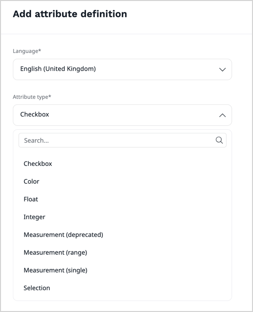

# Work with product attributes

[Attributes](products.md#attributes) describe physical, technical or other characteristics of a product. 
They are organized into attribute groups, and when you assign attributes to products, you can assign either whole groups or individual attributes.
You can use attributes to create multiple versions of one product, called [product variants](work_with_product_variants.md). 
Store visitors can use them to filter and search for products.

Attribute types define what type of information you can store in an attribute.
Available attribute types are:

- Checkbox - represents a Boolean value
- Color - presented as a hex value
- Float - represents a number with fractions
- Integer - represents a number without fractions (a whole number)
- Measurement (range) - measurement with a given unit and minimum/maximum values selectable per product type
- Measurement (single) - measurement with a single value in given unit
- Selection - one of a list of customizable options

If the default list of attributes is not sufficient, ask your development team to [create a custom attribute type]([[= developer_doc =]]/pim/create_custom_attribute_type/).

## Create attribute groups

Before you can proceed with creating attributes, you must first create at least one attribute group.
With groups, you can organize attributes based on attribute type ("Physical", "Abstract"), product type ("Hardware", "Software'), or other criteria.

1\. In the left panel, click **Product catalog** -> **Attribute groups** and click **Create**.

2\. Fill in basic attribute name information: name and identifier.

Each identifier must be unique. It can have up to 64 characters and contain only letters, numbers, underscores, and dashes.

3\. Click **Create**. 

## Create attributes

1\. In the left panel, click **Product catalog** -> **Attributes** and click **Create**.

2\. From the drop-down list, choose an attribute type and click **Add**.

3\. Fill in basic attribute information: name and identifier.

Each identifier must be unique. It can have up to 64 characters and contain only letters, numbers, underscores, and dashes.

4\. Select an attribute group to which the attribute is assigned. 

After you assign an attribute to a group and save your changes, the assignment can't be changed.

5\. Optionally, add a description for the attribute.

6\. Depending on the attribute type selected, set the attribute parameters, for example:

- For a measurement, select either of the measurement types and a base unit
- For a selection, populate the **Options** list with label-value pairs
- For integer, float and range, optionally, set a minimum and maximum value

7\. Click **Save**.